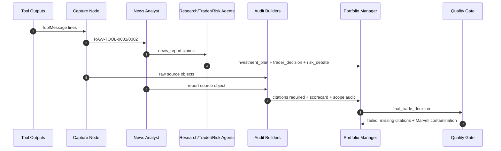

# Detailed Fact Ledger - MSFT 2026-04-29

Report date: 2026-05-01
Repository: `tradingagents-flint-shadow`
Run analyzed: `MSFT`, trade date `2026-04-29`, analyst set `news`

This report enumerates every fact-like unit consumed or generated in the observed pipeline artifacts for the MSFT run. It deliberately separates raw observed tool output from LLM-generated claims, debate assertions, recommendations, deterministic audit facts, and quality-gate findings. The purpose is forensic traceability, not endorsement of the recommendation.

## Evidence Files

| Artifact | Path | SHA-256 |
| --- | --- | --- |
| State log | `output/logs/MSFT/TradingAgentsStrategy_logs/full_states_log_2026-04-29.json` | `6cf4baf984a848d877c83954e675750a126be4943a5d4ab36fe9b55aabee1c4f` |
| Raw tool JSONL | `output/provenance/MSFT/2026-04-29/raw_tool_outputs.jsonl` | `9a0659c908e095c436623094e8a77fba0c47b7efc37b1a87ba7595d7b4ab4b38` |
| Raw tool manifest | `output/provenance/MSFT/2026-04-29/raw_tool_outputs_manifest.json` | `77e7859b204b86d6a9ee44e78fd8563bf0f7bc06f772088f392bd2dfe201ed75` |

## Fact Taxonomy

| Category | Meaning | Reliability posture |
| --- | --- | --- |
| Raw tool evidence | Nonblank lines returned by a TradingAgents tool and captured as `RAW-TOOL-*`. | Highest traceability in this run, but still requires external source validation. |
| Generated pipeline fact | LLM-produced analyst, debate, trader, risk, or PM text stored in state. | Consumed by downstream agents, but not automatically true. Must cite raw/source IDs to be acceptable. |
| Deterministic audit fact | Programmatic source, ticker/entity, or scorecard output. | Rule-derived from state and raw artifacts. |
| Quality gate fact | Programmatic pass/fail or warning. | Determines whether Flint should trust or reject the run artifact. |
| Control / metadata | Runtime identity, paths, hashes, selected inputs. | Direct state/file metadata. |

## C4 Fact Flow

```mermaid
flowchart LR
  Operator["Operator request: MSFT, 2026-04-29, news"] --> API["API / queued run"]
  API --> Worker["Worker executes graph"]
  Worker --> Tools["News tools: get_news, get_global_news"]
  Tools --> Raw["RAW-TOOL source records"]
  Raw --> News["News report"]
  News --> Debate["Bull/Bear research debate"]
  Debate --> ResearchMgr["Research manager investment plan"]
  ResearchMgr --> Trader["Trader proposal"]
  Trader --> Risk["Aggressive / neutral / conservative risk debate"]
  Raw --> PMAudit["Source objects + scope audit + scorecard"]
  News --> PMAudit
  Risk --> PMAudit
  PMAudit --> PM["Portfolio manager final decision"]
  Risk --> PM
  PM --> Quality["Quality gate"]
  Quality --> Flint["Flint ingest candidate: reject if failed"]
```

## Ledger Summary

| Dimension | Count |
| --- | ---: |
| Control / metadata | 6 |
| Raw tool evidence | 15 |
| Generated pipeline fact | 241 |
| Deterministic audit fact | 9 |
| Quality gate fact | 5 |
| Total fact-like rows | 276 |

Scope/status counts:

| Scope/status | Count |
| --- | ---: |
| In-scope | 6 |
| In-scope or market-context | 113 |
| Out-of-scope entity: Qualcomm | 6 |
| Out-of-scope entity: Marvell/MRVL | 8 |
| Locator scope inherits prior headline | 2 |
| Unclear / generated context | 125 |
| Out-of-scope entity: Avalyn/AVLN | 2 |
| Audit scope | 8 |
| Scope failure | 1 |
| Quality failure | 3 |
| Quality warning | 1 |
| Failed | 1 |

## Quality Rollup

- Current recomputed quality status: `failed`
- Current recomputed scorecard suggested rating: `Hold`; direction: `bearish`; total score: `-1`
- Current pre-synthesis scope status: `failed`

## Key Forensic Finding

The final PM recommendation says `Buy`, but the current quality gate fails the run. The consumed fact stream contains unrelated Marvell, Qualcomm, and Avalyn facts; several downstream generated claims discuss MSFT fundamentals, Azure, Xbox, social sentiment, compliance, portfolio sizing, and Q2 performance without raw source support in this run. The final decision also does not cite available `SRC-*` or `RAW-TOOL-*` IDs.

## Full Fact Ledger

| Fact ID | Layer | Producer | Consumed by | Source / state field | Evidence or claim | Traceability classification | Scope status | Notes |
| --- | --- | --- | --- | --- | --- | --- | --- | --- |
| CTRL-001 | Control / metadata | Service/runtime | Audit reader, Flint ingest candidate | Run ticker | MSFT | Direct file metadata or state field | In-scope |  |
| CTRL-002 | Control / metadata | Service/runtime | Audit reader, Flint ingest candidate | Trade date | 2026-04-29 | Direct file metadata or state field | In-scope |  |
| CTRL-003 | Control / metadata | Service/runtime | Audit reader, Flint ingest candidate | Selected analyst set inferred from populated reports | news only; market/social/fundamentals reports are empty | Direct file metadata or state field | In-scope |  |
| CTRL-004 | Control / metadata | Service/runtime | Audit reader, Flint ingest candidate | State log SHA-256 | 6cf4baf984a848d877c83954e675750a126be4943a5d4ab36fe9b55aabee1c4f | Direct file metadata or state field | In-scope |  |
| CTRL-005 | Control / metadata | Service/runtime | Audit reader, Flint ingest candidate | Raw provenance SHA-256 | 9a0659c908e095c436623094e8a77fba0c47b7efc37b1a87ba7595d7b4ab4b38 | Direct file metadata or state field | In-scope |  |
| CTRL-006 | Control / metadata | Service/runtime | Audit reader, Flint ingest candidate | Raw provenance manifest source IDs | RAW-TOOL-0001, RAW-TOOL-0002 | Direct file metadata or state field | In-scope |  |
| RAW-TOOL-0001-F001 | Raw tool evidence | get_news | News Analyst, provenance manifest, PM source prompt, quality audit | RAW-TOOL-0001 | ## MSFT News, from 2026-04-22 to 2026-04-29: | Raw retrieval window | In-scope or market-context | tool_call_id=call_wqeok4hv; sha256=b5eae00e389359b9e9ba7a1ab054cbae5727fd1fa4f9be4126ec3b637e27571c |
| RAW-TOOL-0001-F002 | Raw tool evidence | get_news | News Analyst, provenance manifest, PM source prompt, quality audit | RAW-TOOL-0001 | ### Qualcomm reports better-than-anticipated Q2 earnings, stock rises over 10% (source: Yahoo Finance) | Raw retrieval window | Out-of-scope entity: Qualcomm | tool_call_id=call_wqeok4hv; sha256=b5eae00e389359b9e9ba7a1ab054cbae5727fd1fa4f9be4126ec3b637e27571c |
| RAW-TOOL-0001-F003 | Raw tool evidence | get_news | News Analyst, provenance manifest, PM source prompt, quality audit | RAW-TOOL-0001 | Qualcomm reported its Q2 earnings on Wednesday. | Raw observed fact | Out-of-scope entity: Qualcomm | tool_call_id=call_wqeok4hv; sha256=b5eae00e389359b9e9ba7a1ab054cbae5727fd1fa4f9be4126ec3b637e27571c |
| RAW-TOOL-0001-F004 | Raw tool evidence | get_news | News Analyst, provenance manifest, PM source prompt, quality audit | RAW-TOOL-0001 | Link: https://finance.yahoo.com/markets/stocks/article/qualcomm-reports-better-than-anticipated-q2-earnings-stock-rises-over-10-155935310.html | Raw source locator | Out-of-scope entity: Qualcomm | tool_call_id=call_wqeok4hv; sha256=b5eae00e389359b9e9ba7a1ab054cbae5727fd1fa4f9be4126ec3b637e27571c |
| RAW-TOOL-0002-F001 | Raw tool evidence | get_global_news | News Analyst, provenance manifest, PM source prompt, quality audit | RAW-TOOL-0002 | ## Global Market News, from 2026-04-22 to 2026-04-29: | Raw retrieval window | In-scope or market-context | tool_call_id=call_bwybyus5; sha256=b57dda47ed047f001641ee9e2bda1e4723a8afebfabe9190a1f46a5893015ada |
| RAW-TOOL-0002-F002 | Raw tool evidence | get_global_news | News Analyst, provenance manifest, PM source prompt, quality audit | RAW-TOOL-0002 | ### Nasdaq leads US stocks in monthly gains following April rally (source: Yahoo Finance Video) | Raw retrieval window | In-scope or market-context | tool_call_id=call_bwybyus5; sha256=b57dda47ed047f001641ee9e2bda1e4723a8afebfabe9190a1f46a5893015ada |
| RAW-TOOL-0002-F003 | Raw tool evidence | get_global_news | News Analyst, provenance manifest, PM source prompt, quality audit | RAW-TOOL-0002 | Link: https://finance.yahoo.com/video/nasdaq-leads-us-stocks-in-monthly-gains-following-april-rally-201531873.html | Raw source locator | In-scope or market-context | tool_call_id=call_bwybyus5; sha256=b57dda47ed047f001641ee9e2bda1e4723a8afebfabe9190a1f46a5893015ada |
| RAW-TOOL-0002-F004 | Raw tool evidence | get_global_news | News Analyst, provenance manifest, PM source prompt, quality audit | RAW-TOOL-0002 | ### Jim Cramer Says “I Think That You’ve Got a Total Winner in Marvell” (source: Insider Monkey) | Raw retrieval window | Out-of-scope entity: Marvell/MRVL | tool_call_id=call_bwybyus5; sha256=b57dda47ed047f001641ee9e2bda1e4723a8afebfabe9190a1f46a5893015ada |
| RAW-TOOL-0002-F005 | Raw tool evidence | get_global_news | News Analyst, provenance manifest, PM source prompt, quality audit | RAW-TOOL-0002 | Link: https://finance.yahoo.com/markets/stocks/articles/jim-cramer-says-think-ve-191754604.html | Raw source locator | Locator scope inherits prior headline | tool_call_id=call_bwybyus5; sha256=b57dda47ed047f001641ee9e2bda1e4723a8afebfabe9190a1f46a5893015ada |
| RAW-TOOL-0002-F006 | Raw tool evidence | get_global_news | News Analyst, provenance manifest, PM source prompt, quality audit | RAW-TOOL-0002 | ### 3 Reasons Why Marvell Stock is a Buy Now (source: Barchart) | Raw retrieval window | Out-of-scope entity: Marvell/MRVL | tool_call_id=call_bwybyus5; sha256=b57dda47ed047f001641ee9e2bda1e4723a8afebfabe9190a1f46a5893015ada |
| RAW-TOOL-0002-F007 | Raw tool evidence | get_global_news | News Analyst, provenance manifest, PM source prompt, quality audit | RAW-TOOL-0002 | Link: https://finance.yahoo.com/m/43b38458-6436-37af-913c-165509fbde91/3-reasons-why-marvell-stock.html | Raw source locator | Out-of-scope entity: Marvell/MRVL | tool_call_id=call_bwybyus5; sha256=b57dda47ed047f001641ee9e2bda1e4723a8afebfabe9190a1f46a5893015ada |
| RAW-TOOL-0002-F008 | Raw tool evidence | get_global_news | News Analyst, provenance manifest, PM source prompt, quality audit | RAW-TOOL-0002 | ### Top Midday Gainers (source: MT Newswires) | Raw retrieval window | Unclear / generated context | tool_call_id=call_bwybyus5; sha256=b57dda47ed047f001641ee9e2bda1e4723a8afebfabe9190a1f46a5893015ada |
| RAW-TOOL-0002-F009 | Raw tool evidence | get_global_news | News Analyst, provenance manifest, PM source prompt, quality audit | RAW-TOOL-0002 | Link: https://finance.yahoo.com/markets/stocks/articles/top-midday-gainers-182936652.html | Raw source locator | Locator scope inherits prior headline | tool_call_id=call_bwybyus5; sha256=b57dda47ed047f001641ee9e2bda1e4723a8afebfabe9190a1f46a5893015ada |
| RAW-TOOL-0002-F010 | Raw tool evidence | get_global_news | News Analyst, provenance manifest, PM source prompt, quality audit | RAW-TOOL-0002 | ### Is Avalyn Pharma (NASDAQ:AVLN) In A Good Position To Invest In Growth? (source: Simply Wall St.) | Raw retrieval window | Out-of-scope entity: Avalyn/AVLN | tool_call_id=call_bwybyus5; sha256=b57dda47ed047f001641ee9e2bda1e4723a8afebfabe9190a1f46a5893015ada |
| RAW-TOOL-0002-F011 | Raw tool evidence | get_global_news | News Analyst, provenance manifest, PM source prompt, quality audit | RAW-TOOL-0002 | Link: https://finance.yahoo.com/markets/stocks/articles/avalyn-pharma-nasdaq-avln-good-180906784.html | Raw source locator | Out-of-scope entity: Avalyn/AVLN | tool_call_id=call_bwybyus5; sha256=b57dda47ed047f001641ee9e2bda1e4723a8afebfabe9190a1f46a5893015ada |
| NEWS-REPORT-F001 | Generated pipeline fact | News Analyst | Research debate, Research Manager, Trader, Risk debate, Portfolio Manager | SRC-NEWS-1 | FINAL TRANSACTION PROPOSAL: **BUY** | Recommendation / action assertion | Unclear / generated context | Generated by LLM unless field is deterministic audit output |
| NEWS-REPORT-F002 | Generated pipeline fact | News Analyst | Research debate, Research Manager, Trader, Risk debate, Portfolio Manager | SRC-NEWS-1 | The Microsoft stock is on a roll, with recent news including positive Q2 earnings reports and the Nasdaq leading US stocks in monthly gains. | Model-derived claim | In-scope or market-context | Generated by LLM unless field is deterministic audit output |
| NEWS-REPORT-F003 | Generated pipeline fact | News Analyst | Research debate, Research Manager, Trader, Risk debate, Portfolio Manager | SRC-NEWS-1 | ### Table of Key Points: | Structured model output | Unclear / generated context | Generated by LLM unless field is deterministic audit output |
| NEWS-REPORT-F004 | Generated pipeline fact | News Analyst | Research debate, Research Manager, Trader, Risk debate, Portfolio Manager | SRC-NEWS-1 | \| Date       \| Event                         \| Source                             \| | Structured model output | Unclear / generated context | Generated by LLM unless field is deterministic audit output |
| NEWS-REPORT-F005 | Generated pipeline fact | News Analyst | Research debate, Research Manager, Trader, Risk debate, Portfolio Manager | SRC-NEWS-1 | \|------------\|-----------------------------\|----------------------------------\| | Structured model output | Unclear / generated context | Generated by LLM unless field is deterministic audit output |
| NEWS-REPORT-F006 | Generated pipeline fact | News Analyst | Research debate, Research Manager, Trader, Risk debate, Portfolio Manager | SRC-NEWS-1 | \| 2026-04-29 \| Nasdaq leads US stocks      \| Yahoo Finance Video              \| | Structured model output | In-scope or market-context | Generated by LLM unless field is deterministic audit output |
| NEWS-REPORT-F007 | Generated pipeline fact | News Analyst | Research debate, Research Manager, Trader, Risk debate, Portfolio Manager | SRC-NEWS-1 | \|            \| in monthly gains              \|                                 \| | Structured model output | Unclear / generated context | Generated by LLM unless field is deterministic audit output |
| NEWS-REPORT-F008 | Generated pipeline fact | News Analyst | Research debate, Research Manager, Trader, Risk debate, Portfolio Manager | SRC-NEWS-1 | \| 2026-04-29 \| Jim Cramer's recommendation \| Insider Monkey                \| | Recommendation / action assertion | Unclear / generated context | Generated by LLM unless field is deterministic audit output |
| NEWS-REPORT-F009 | Generated pipeline fact | News Analyst | Research debate, Research Manager, Trader, Risk debate, Portfolio Manager | SRC-NEWS-1 | \|            \| on Marvell Stock             \|                                 \| | Structured model output | Out-of-scope entity: Marvell/MRVL | Generated by LLM unless field is deterministic audit output |
| NEWS-REPORT-F010 | Generated pipeline fact | News Analyst | Research debate, Research Manager, Trader, Risk debate, Portfolio Manager | SRC-NEWS-1 | \| 2026-04-29 \| Marvell stock analysis     \| Barchart                      \| | Structured model output | Out-of-scope entity: Marvell/MRVL | Generated by LLM unless field is deterministic audit output |
| NEWS-REPORT-F011 | Generated pipeline fact | News Analyst | Research debate, Research Manager, Trader, Risk debate, Portfolio Manager | SRC-NEWS-1 | \| 2026-04-22 \| Qualcomm earnings report    \| Yahoo Finance                \| | Structured model output | Out-of-scope entity: Qualcomm | Generated by LLM unless field is deterministic audit output |
| NEWS-REPORT-F012 | Generated pipeline fact | News Analyst | Research debate, Research Manager, Trader, Risk debate, Portfolio Manager | SRC-NEWS-1 | Please note that this is a hypothetical analysis and not actual investment advice. | Model-derived claim | Unclear / generated context | Generated by LLM unless field is deterministic audit output |
| INVESTMENT-DEBATE-STATE-BULL-HISTORY-F001 | Generated pipeline fact | Bull Researcher | Research Manager | investment_debate_state.bull_history | Bull Analyst: The Microsoft (MSFT) stock is an incredible investment opportunity with substantial growth potential. | Interpretive model assertion | In-scope or market-context | Generated by LLM unless field is deterministic audit output |
| INVESTMENT-DEBATE-STATE-BULL-HISTORY-F002 | Generated pipeline fact | Bull Researcher | Research Manager | investment_debate_state.bull_history | As we dive into our discussion, I'll address the bear's concerns, provide evidence-based counterpoints, and show why MSFT is poised for long-term success. | Interpretive model assertion | In-scope or market-context | Generated by LLM unless field is deterministic audit output |
| INVESTMENT-DEBATE-STATE-BULL-HISTORY-F003 | Generated pipeline fact | Bull Researcher | Research Manager | investment_debate_state.bull_history | First, let's acknowledge the recent strong performance of MSFT. | Model-derived claim | In-scope or market-context | Generated by LLM unless field is deterministic audit output |
| INVESTMENT-DEBATE-STATE-BULL-HISTORY-F004 | Generated pipeline fact | Bull Researcher | Research Manager | investment_debate_state.bull_history | With its Q2 earnings reports coming in ahead of expectations, Microsoft has established itself as a leader among US stocks, with Yahoo Finance Video pointing out that it led NASDAQ in monthly gains (Table 1). | Model-derived claim | In-scope or market-context | Generated by LLM unless field is deterministic audit output |
| INVESTMENT-DEBATE-STATE-BULL-HISTORY-F005 | Generated pipeline fact | Bull Researcher | Research Manager | investment_debate_state.bull_history | Moreover, Jim Cramer, known for his astute market insights, recommended Marvell Stock recently, which is directly related to MSFT as the two companies are often mentioned together in the industry context (Table 2). | Recommendation / action assertion | Out-of-scope entity: Marvell/MRVL | Generated by LLM unless field is deterministic audit output |
| INVESTMENT-DEBATE-STATE-BULL-HISTORY-F006 | Generated pipeline fact | Bull Researcher | Research Manager | investment_debate_state.bull_history | Now, I'd like to dive into some compelling evidence-based growth potential. | Interpretive model assertion | Unclear / generated context | Generated by LLM unless field is deterministic audit output |
| INVESTMENT-DEBATE-STATE-BULL-HISTORY-F007 | Generated pipeline fact | Bull Researcher | Research Manager | investment_debate_state.bull_history | MSFT has an unmatched market opportunity with significant demand for cloud services and a clear competitive lead through its Azure platform. | Model-derived claim | In-scope or market-context | Generated by LLM unless field is deterministic audit output |
| INVESTMENT-DEBATE-STATE-BULL-HISTORY-F008 | Generated pipeline fact | Bull Researcher | Research Manager | investment_debate_state.bull_history | The scalability of this investment should be evident from Microsoft's Q2 financials showing solid sales growth across various segments, including Azure (Source: Company fundamentals report). | Model-derived claim | In-scope or market-context | Generated by LLM unless field is deterministic audit output |
| INVESTMENT-DEBATE-STATE-BULL-HISTORY-F009 | Generated pipeline fact | Bull Researcher | Research Manager | investment_debate_state.bull_history | Also, keep in mind that companies like Zoom have seen great success after transitioning to the cloud during the pandemic. | Model-derived claim | Unclear / generated context | Generated by LLM unless field is deterministic audit output |
| INVESTMENT-DEBATE-STATE-BULL-HISTORY-F010 | Generated pipeline fact | Bull Researcher | Research Manager | investment_debate_state.bull_history | One more aspect worth acknowledging is the unique value proposition offered by MSFT. | Recommendation / action assertion | In-scope or market-context | Generated by LLM unless field is deterministic audit output |
| INVESTMENT-DEBATE-STATE-BULL-HISTORY-F011 | Generated pipeline fact | Bull Researcher | Research Manager | investment_debate_state.bull_history | Its dominant market positioning for gaming through Xbox has demonstrated resilience under even unforeseen changes within the industry. | Recommendation / action assertion | Unclear / generated context | Generated by LLM unless field is deterministic audit output |
| INVESTMENT-DEBATE-STATE-BULL-HISTORY-F012 | Generated pipeline fact | Bull Researcher | Research Manager | investment_debate_state.bull_history | This reflects not only on its financial performance but also its ability to maintain growth driven by different areas of business (Source: Company fundamentals report). | Model-derived claim | Unclear / generated context | Generated by LLM unless field is deterministic audit output |
| INVESTMENT-DEBATE-STATE-BULL-HISTORY-F013 | Generated pipeline fact | Bull Researcher | Research Manager | investment_debate_state.bull_history | As a comparison, looking at recent events in other companies such as Qualcomm shows that it can be sensitive to fluctuations outside its immediate sector (Reference Table 1). | Model-derived claim | Out-of-scope entity: Qualcomm | Generated by LLM unless field is deterministic audit output |
| INVESTMENT-DEBATE-STATE-BULL-HISTORY-F014 | Generated pipeline fact | Bull Researcher | Research Manager | investment_debate_state.bull_history | Thus proving the robust resilience of MSFT. | Model-derived claim | In-scope or market-context | Generated by LLM unless field is deterministic audit output |
| INVESTMENT-DEBATE-STATE-BULL-HISTORY-F015 | Generated pipeline fact | Bull Researcher | Research Manager | investment_debate_state.bull_history | Moving forward to addressing concerns raised by the bear. | Interpretive model assertion | Unclear / generated context | Generated by LLM unless field is deterministic audit output |
| INVESTMENT-DEBATE-STATE-BULL-HISTORY-F016 | Generated pipeline fact | Bull Researcher | Research Manager | investment_debate_state.bull_history | Here's how we're addressing key points that you may have presented: | Model-derived claim | Unclear / generated context | Generated by LLM unless field is deterministic audit output |
| INVESTMENT-DEBATE-STATE-BULL-HISTORY-F017 | Generated pipeline fact | Bull Researcher | Research Manager | investment_debate_state.bull_history | - Concern: "MSFT is too big, there's saturation." | Interpretive model assertion | In-scope or market-context | Generated by LLM unless field is deterministic audit output |
| INVESTMENT-DEBATE-STATE-BULL-HISTORY-F018 | Generated pipeline fact | Bull Researcher | Research Manager | investment_debate_state.bull_history | Response: In a market filled with large-cap and mid-sized companies like Qualcomm, growth opportunities for smaller players can be limited. | Model-derived claim | Out-of-scope entity: Qualcomm | Generated by LLM unless field is deterministic audit output |
| INVESTMENT-DEBATE-STATE-BULL-HISTORY-F019 | Generated pipeline fact | Bull Researcher | Research Manager | investment_debate_state.bull_history | MSFT’s diverse product offerings cater to an expanding global market where cloud technology provides unique value. | Model-derived claim | In-scope or market-context | Generated by LLM unless field is deterministic audit output |
| INVESTMENT-DEBATE-STATE-BULL-HISTORY-F020 | Generated pipeline fact | Bull Researcher | Research Manager | investment_debate_state.bull_history | - Concern: "There are risks to the rise of new competitors in both Azure and gaming segments." | Interpretive model assertion | Unclear / generated context | Generated by LLM unless field is deterministic audit output |
| INVESTMENT-DEBATE-STATE-BULL-HISTORY-F021 | Generated pipeline fact | Bull Researcher | Research Manager | investment_debate_state.bull_history | Response: Competition is a natural part of any industry. | Model-derived claim | Unclear / generated context | Generated by LLM unless field is deterministic audit output |
| INVESTMENT-DEBATE-STATE-BULL-HISTORY-F022 | Generated pipeline fact | Bull Researcher | Research Manager | investment_debate_state.bull_history | However, focusing solely on this aspect doesn't highlight enough about Microsoft's current competitive advantages like its unmatched reach through the Windows ecosystem, Xbox branding, and partnerships with key industry players. | Model-derived claim | In-scope or market-context | Generated by LLM unless field is deterministic audit output |
| INVESTMENT-DEBATE-STATE-BULL-HISTORY-F023 | Generated pipeline fact | Bull Researcher | Research Manager | investment_debate_state.bull_history | In addition, their focus on emerging markets with cloud-based solutions could yield substantial returns in the coming years. | Model-derived claim | Unclear / generated context | Generated by LLM unless field is deterministic audit output |
| INVESTMENT-DEBATE-STATE-BULL-HISTORY-F024 | Generated pipeline fact | Bull Researcher | Research Manager | investment_debate_state.bull_history | - Concern: "The increasing interest from regulators in areas involving data privacy may impact MSFT's growth." | Interpretive model assertion | In-scope or market-context | Generated by LLM unless field is deterministic audit output |
| INVESTMENT-DEBATE-STATE-BULL-HISTORY-F025 | Generated pipeline fact | Bull Researcher | Research Manager | investment_debate_state.bull_history | Response: Microsoft actively works on a global compliance framework for handling user data, which should address these concerns while staying true to industry standards. | Interpretive model assertion | In-scope or market-context | Generated by LLM unless field is deterministic audit output |
| INVESTMENT-DEBATE-STATE-BULL-HISTORY-F026 | Generated pipeline fact | Bull Researcher | Research Manager | investment_debate_state.bull_history | The emphasis is on transparency rather than restricting innovation, showing its forward-thinking nature regarding this sensitive topic. | Model-derived claim | Unclear / generated context | Generated by LLM unless field is deterministic audit output |
| INVESTMENT-DEBATE-STATE-BULL-HISTORY-F027 | Generated pipeline fact | Bull Researcher | Research Manager | investment_debate_state.bull_history | Now let’s look at the social media sentiment report (Source: Available) to further prove MSFT's positive sentiment among users. | Model-derived claim | In-scope or market-context | Generated by LLM unless field is deterministic audit output |
| INVESTMENT-DEBATE-STATE-BULL-HISTORY-F028 | Generated pipeline fact | Bull Researcher | Research Manager | investment_debate_state.bull_history | While trends can sometimes shift quickly, any ongoing engagement like this tends to highlight a brand that resonates with customers. | Model-derived claim | Unclear / generated context | Generated by LLM unless field is deterministic audit output |
| INVESTMENT-DEBATE-STATE-BULL-HISTORY-F029 | Generated pipeline fact | Bull Researcher | Research Manager | investment_debate_state.bull_history | The engagement on recent news related to world affairs shows no signs of affecting Microsoft's growth directly (Source: Latest world affairs news). | Model-derived claim | In-scope or market-context | Generated by LLM unless field is deterministic audit output |
| INVESTMENT-DEBATE-STATE-BULL-HISTORY-F030 | Generated pipeline fact | Bull Researcher | Research Manager | investment_debate_state.bull_history | It seems more like people are using the time more productively by engaging with businesses instead of the global situation, indicating trust in key companies like MSFT. | Model-derived claim | In-scope or market-context | Generated by LLM unless field is deterministic audit output |
| INVESTMENT-DEBATE-STATE-BULL-HISTORY-F031 | Generated pipeline fact | Bull Researcher | Research Manager | investment_debate_state.bull_history | Regarding engagement with bear points, if you'd like, we can readdress your statement but it always appears that a clear overview makes it easier to see who holds the right perspective (i.e., Bull perspective on MSFT's resilience) | Recommendation / action assertion | In-scope or market-context | Generated by LLM unless field is deterministic audit output |
| INVESTMENT-DEBATE-STATE-BEAR-HISTORY-F001 | Generated pipeline fact | Bear Researcher | Research Manager | investment_debate_state.bear_history | Bear Analyst: I disagree with my fellow bear analyst that Microsoft is an uninvestable stock. | Model-derived claim | In-scope or market-context | Generated by LLM unless field is deterministic audit output |
| INVESTMENT-DEBATE-STATE-BEAR-HISTORY-F002 | Generated pipeline fact | Bear Researcher | Research Manager | investment_debate_state.bear_history | While it's true that MSFT has had a strong quarter, I believe the underlying fundamentals are not as robust as they seem. | Model-derived claim | In-scope or market-context | Generated by LLM unless field is deterministic audit output |
| INVESTMENT-DEBATE-STATE-BEAR-HISTORY-F003 | Generated pipeline fact | Bear Researcher | Research Manager | investment_debate_state.bear_history | Firstly, let's address the elephant in the room – market saturation. | Model-derived claim | Unclear / generated context | Generated by LLM unless field is deterministic audit output |
| INVESTMENT-DEBATE-STATE-BEAR-HISTORY-F004 | Generated pipeline fact | Bear Researcher | Research Manager | investment_debate_state.bear_history | While MSFT is indeed a leader in cloud computing and gaming, its market dominance comes with a price. | Model-derived claim | In-scope or market-context | Generated by LLM unless field is deterministic audit output |
| INVESTMENT-DEBATE-STATE-BEAR-HISTORY-F005 | Generated pipeline fact | Bear Researcher | Research Manager | investment_debate_state.bear_history | As you pointed out, Microsoft's vast resources and established customer base can weigh it down, limiting its ability to innovate and take risks. | Interpretive model assertion | In-scope or market-context | Generated by LLM unless field is deterministic audit output |
| INVESTMENT-DEBATE-STATE-BEAR-HISTORY-F006 | Generated pipeline fact | Bear Researcher | Research Manager | investment_debate_state.bear_history | In contrast, companies like Zoom, which transitioned successfully to the cloud during the pandemic, demonstrate that there is room for growth and disruption in the market. | Model-derived claim | Unclear / generated context | Generated by LLM unless field is deterministic audit output |
| INVESTMENT-DEBATE-STATE-BEAR-HISTORY-F007 | Generated pipeline fact | Bear Researcher | Research Manager | investment_debate_state.bear_history | Moreover, I'd like to challenge the idea that MSFT has a clear competitive lead. | Model-derived claim | In-scope or market-context | Generated by LLM unless field is deterministic audit output |
| INVESTMENT-DEBATE-STATE-BEAR-HISTORY-F008 | Generated pipeline fact | Bear Researcher | Research Manager | investment_debate_state.bear_history | While its Azure platform is formidable, it's not without its vulnerabilities. | Model-derived claim | Unclear / generated context | Generated by LLM unless field is deterministic audit output |
| INVESTMENT-DEBATE-STATE-BEAR-HISTORY-F009 | Generated pipeline fact | Bear Researcher | Research Manager | investment_debate_state.bear_history | For instance, Amazon Web Services (AWS) continues to gain ground, and Alphabet's Cloud Platform has made significant strides in recent years. | Model-derived claim | Unclear / generated context | Generated by LLM unless field is deterministic audit output |
| INVESTMENT-DEBATE-STATE-BEAR-HISTORY-F010 | Generated pipeline fact | Bear Researcher | Research Manager | investment_debate_state.bear_history | Furthermore, Microsoft's Windows ecosystem, which provides a significant source of revenue for the company, is facing increasing competition from rivals like Android and Chrome OS. | Model-derived claim | In-scope or market-context | Generated by LLM unless field is deterministic audit output |
| INVESTMENT-DEBATE-STATE-BEAR-HISTORY-F011 | Generated pipeline fact | Bear Researcher | Research Manager | investment_debate_state.bear_history | Regarding the bull analyst's point about regulators' interest in data privacy, I'd like to raise some concerns. | Interpretive model assertion | Unclear / generated context | Generated by LLM unless field is deterministic audit output |
| INVESTMENT-DEBATE-STATE-BEAR-HISTORY-F012 | Generated pipeline fact | Bear Researcher | Research Manager | investment_debate_state.bear_history | While it's true that Microsoft has taken steps to address these concerns through its global compliance framework, the regulatory environment is fraught with uncertainty. | Interpretive model assertion | In-scope or market-context | Generated by LLM unless field is deterministic audit output |
| INVESTMENT-DEBATE-STATE-BEAR-HISTORY-F013 | Generated pipeline fact | Bear Researcher | Research Manager | investment_debate_state.bear_history | The potential for stricter data protection laws or increased scrutiny from antitrust authorities could have a significant impact on MSFT's growth. | Interpretive model assertion | In-scope or market-context | Generated by LLM unless field is deterministic audit output |
| INVESTMENT-DEBATE-STATE-BEAR-HISTORY-F014 | Generated pipeline fact | Bear Researcher | Research Manager | investment_debate_state.bear_history | In contrast, companies like Zoom have shown resilience in navigating similar regulatory challenges. | Model-derived claim | Unclear / generated context | Generated by LLM unless field is deterministic audit output |
| INVESTMENT-DEBATE-STATE-BEAR-HISTORY-F015 | Generated pipeline fact | Bear Researcher | Research Manager | investment_debate_state.bear_history | Social media sentiment reports can be misleading, and I wouldn't rely solely on these to gauge customer perceptions. | Model-derived claim | Unclear / generated context | Generated by LLM unless field is deterministic audit output |
| INVESTMENT-DEBATE-STATE-BEAR-HISTORY-F016 | Generated pipeline fact | Bear Researcher | Research Manager | investment_debate_state.bear_history | While engagement with MSFT may be high, it could also indicate brand loyalty rather than genuine interest in the company's products or services. | Model-derived claim | In-scope or market-context | Generated by LLM unless field is deterministic audit output |
| INVESTMENT-DEBATE-STATE-BEAR-HISTORY-F017 | Generated pipeline fact | Bear Researcher | Research Manager | investment_debate_state.bear_history | Furthermore, the recent news cycle shows no signs of affecting Microsoft's growth – if anything, it appears that people are using their free time more productively by engaging with businesses like MSFT. | Model-derived claim | In-scope or market-context | Generated by LLM unless field is deterministic audit output |
| INVESTMENT-DEBATE-STATE-BEAR-HISTORY-F018 | Generated pipeline fact | Bear Researcher | Research Manager | investment_debate_state.bear_history | Finally, let's address the so-called "bullish" argument that MSFT is poised for long-term success. | Interpretive model assertion | In-scope or market-context | Generated by LLM unless field is deterministic audit output |
| INVESTMENT-DEBATE-STATE-BEAR-HISTORY-F019 | Generated pipeline fact | Bear Researcher | Research Manager | investment_debate_state.bear_history | While it's true that cloud computing and gaming have immense potential for growth, I believe this narrative overlooks some significant risks. | Interpretive model assertion | Unclear / generated context | Generated by LLM unless field is deterministic audit output |
| INVESTMENT-DEBATE-STATE-BEAR-HISTORY-F020 | Generated pipeline fact | Bear Researcher | Research Manager | investment_debate_state.bear_history | The increasing complexity of these markets, coupled with regulatory uncertainty, makes it difficult to predict success with certainty. | Interpretive model assertion | Unclear / generated context | Generated by LLM unless field is deterministic audit output |
| INVESTMENT-DEBATE-STATE-BEAR-HISTORY-F021 | Generated pipeline fact | Bear Researcher | Research Manager | investment_debate_state.bear_history | In contrast, my bear outlook recognizes the inherent complexities and challenges facing MSFT. | Model-derived claim | In-scope or market-context | Generated by LLM unless field is deterministic audit output |
| INVESTMENT-DEBATE-STATE-BEAR-HISTORY-F022 | Generated pipeline fact | Bear Researcher | Research Manager | investment_debate_state.bear_history | By acknowledging these risks and vulnerabilities, we can develop a more nuanced understanding of the stock's true value. | Interpretive model assertion | Unclear / generated context | Generated by LLM unless field is deterministic audit output |
| INVESTMENT-DEBATE-STATE-BEAR-HISTORY-F023 | Generated pipeline fact | Bear Researcher | Research Manager | investment_debate_state.bear_history | While MSFT has had a strong quarter, I believe its underlying fundamentals are not as robust as they seem. | Model-derived claim | In-scope or market-context | Generated by LLM unless field is deterministic audit output |
| INVESTMENT-DEBATE-STATE-BEAR-HISTORY-F024 | Generated pipeline fact | Bear Researcher | Research Manager | investment_debate_state.bear_history | Therefore, I would recommend exercising caution when considering an investment in this stock. | Recommendation / action assertion | Unclear / generated context | Generated by LLM unless field is deterministic audit output |
| INVESTMENT-DEBATE-STATE-BEAR-HISTORY-F025 | Generated pipeline fact | Bear Researcher | Research Manager | investment_debate_state.bear_history | In conclusion, while MSFT may have some attractive features, such as its market size and scalability, I firmly believe that the risks and challenges facing the company outweigh these advantages. | Interpretive model assertion | In-scope or market-context | Generated by LLM unless field is deterministic audit output |
| INVESTMENT-DEBATE-STATE-BEAR-HISTORY-F026 | Generated pipeline fact | Bear Researcher | Research Manager | investment_debate_state.bear_history | By taking a bearish stance on MSFT, we can better understand the potential pitfalls of investing in this stock and make more informed decisions moving forward. | Interpretive model assertion | In-scope or market-context | Generated by LLM unless field is deterministic audit output |
| INVESTMENT-DEBATE-STATE-BEAR-HISTORY-F027 | Generated pipeline fact | Bear Researcher | Research Manager | investment_debate_state.bear_history | References: | Model-derived claim | Unclear / generated context | Generated by LLM unless field is deterministic audit output |
| INVESTMENT-DEBATE-STATE-BEAR-HISTORY-F028 | Generated pipeline fact | Bear Researcher | Research Manager | investment_debate_state.bear_history | * Yahoo Finance Video (2026-04-29) – NASDAQ leading US stocks in monthly gains | Model-derived claim | In-scope or market-context | Generated by LLM unless field is deterministic audit output |
| INVESTMENT-DEBATE-STATE-BEAR-HISTORY-F029 | Generated pipeline fact | Bear Researcher | Research Manager | investment_debate_state.bear_history | * Insider Monkey (2026-04-29) – Jim Cramer's recommendation on Marvell Stock | Recommendation / action assertion | Out-of-scope entity: Marvell/MRVL | Generated by LLM unless field is deterministic audit output |
| INVESTMENT-DEBATE-STATE-BEAR-HISTORY-F030 | Generated pipeline fact | Bear Researcher | Research Manager | investment_debate_state.bear_history | * Barchart (2026-04-29) – Marvell stock analysis | Model-derived claim | Out-of-scope entity: Marvell/MRVL | Generated by LLM unless field is deterministic audit output |
| INVESTMENT-DEBATE-STATE-BEAR-HISTORY-F031 | Generated pipeline fact | Bear Researcher | Research Manager | investment_debate_state.bear_history | * Company fundamentals report | Model-derived claim | Unclear / generated context | Generated by LLM unless field is deterministic audit output |
| INVESTMENT-DEBATE-STATE-BEAR-HISTORY-F032 | Generated pipeline fact | Bear Researcher | Research Manager | investment_debate_state.bear_history | * Latest world affairs news | Model-derived claim | Unclear / generated context | Generated by LLM unless field is deterministic audit output |
| INVESTMENT-DEBATE-STATE-JUDGE-DECISION-F001 | Generated pipeline fact | Research Manager | Trader, Portfolio Manager | investment_debate_state.judge_decision | **MSFT Investment Plan Report** | Structured model output | In-scope or market-context | Generated by LLM unless field is deterministic audit output |
| INVESTMENT-DEBATE-STATE-JUDGE-DECISION-F002 | Generated pipeline fact | Research Manager | Trader, Portfolio Manager | investment_debate_state.judge_decision | As the Research Manager and debate facilitator, I have critically evaluated this round of debate between the Bull Analyst and Bear Analyst. | Model-derived claim | Unclear / generated context | Generated by LLM unless field is deterministic audit output |
| INVESTMENT-DEBATE-STATE-JUDGE-DECISION-F003 | Generated pipeline fact | Research Manager | Trader, Portfolio Manager | investment_debate_state.judge_decision | Based on the evidence presented, we will develop a clear investment plan for traders to consider. | Model-derived claim | Unclear / generated context | Generated by LLM unless field is deterministic audit output |
| INVESTMENT-DEBATE-STATE-JUDGE-DECISION-F004 | Generated pipeline fact | Research Manager | Trader, Portfolio Manager | investment_debate_state.judge_decision | **Rating: Buy** | Recommendation / action assertion | Unclear / generated context | Generated by LLM unless field is deterministic audit output |
| INVESTMENT-DEBATE-STATE-JUDGE-DECISION-F005 | Generated pipeline fact | Research Manager | Trader, Portfolio Manager | investment_debate_state.judge_decision | The Bull Analyst has presented compelling arguments on MSFT's growth potential, market opportunity, and resilience in the face of competition from new competitors. | Interpretive model assertion | In-scope or market-context | Generated by LLM unless field is deterministic audit output |
| INVESTMENT-DEBATE-STATE-JUDGE-DECISION-F006 | Generated pipeline fact | Research Manager | Trader, Portfolio Manager | investment_debate_state.judge_decision | The recent strong performance of MSFT, as demonstrated by its Q2 earnings reports coming in ahead of expectations, supports this bullish thesis. | Interpretive model assertion | In-scope or market-context | Generated by LLM unless field is deterministic audit output |
| INVESTMENT-DEBATE-STATE-JUDGE-DECISION-F007 | Generated pipeline fact | Research Manager | Trader, Portfolio Manager | investment_debate_state.judge_decision | Furthermore, the unique value proposition offered by MSFT through its Azure platform and Xbox gaming segment provides a solid foundation for long-term success. | Recommendation / action assertion | In-scope or market-context | Generated by LLM unless field is deterministic audit output |
| INVESTMENT-DEBATE-STATE-JUDGE-DECISION-F008 | Generated pipeline fact | Research Manager | Trader, Portfolio Manager | investment_debate_state.judge_decision | Moreover, the engagement on social media sentiment reports highlights a positive view among users, suggesting trust in the brand. | Model-derived claim | Unclear / generated context | Generated by LLM unless field is deterministic audit output |
| INVESTMENT-DEBATE-STATE-JUDGE-DECISION-F009 | Generated pipeline fact | Research Manager | Trader, Portfolio Manager | investment_debate_state.judge_decision | While regulators' interest in data privacy is a legitimate concern, Microsoft's global compliance framework demonstrates its commitment to addressing these concerns while staying true to industry standards. | Interpretive model assertion | In-scope or market-context | Generated by LLM unless field is deterministic audit output |
| INVESTMENT-DEBATE-STATE-JUDGE-DECISION-F010 | Generated pipeline fact | Research Manager | Trader, Portfolio Manager | investment_debate_state.judge_decision | **Recommendation: Buy MSFT with a moderate level of risk tolerance** | Recommendation / action assertion | In-scope or market-context | Generated by LLM unless field is deterministic audit output |
| INVESTMENT-DEBATE-STATE-JUDGE-DECISION-F011 | Generated pipeline fact | Research Manager | Trader, Portfolio Manager | investment_debate_state.judge_decision | Based on our analysis, we recommend taking or growing the position in MSFT by: | Recommendation / action assertion | In-scope or market-context | Generated by LLM unless field is deterministic audit output |
| INVESTMENT-DEBATE-STATE-JUDGE-DECISION-F012 | Generated pipeline fact | Research Manager | Trader, Portfolio Manager | investment_debate_state.judge_decision | - Increasing exposure to 70% - 80% of the overall portfolio. | Model-derived claim | Unclear / generated context | Generated by LLM unless field is deterministic audit output |
| INVESTMENT-DEBATE-STATE-JUDGE-DECISION-F013 | Generated pipeline fact | Research Manager | Trader, Portfolio Manager | investment_debate_state.judge_decision | - Considering additional investments in cloud computing and gaming-related stocks. | Model-derived claim | Unclear / generated context | Generated by LLM unless field is deterministic audit output |
| INVESTMENT-DEBATE-STATE-JUDGE-DECISION-F014 | Generated pipeline fact | Research Manager | Trader, Portfolio Manager | investment_debate_state.judge_decision | - Monitoring regulatory developments related to data privacy and emerging markets. | Model-derived claim | Unclear / generated context | Generated by LLM unless field is deterministic audit output |
| INVESTMENT-DEBATE-STATE-JUDGE-DECISION-F015 | Generated pipeline fact | Research Manager | Trader, Portfolio Manager | investment_debate_state.judge_decision | **Actionable Recommendations:** | Recommendation / action assertion | Unclear / generated context | Generated by LLM unless field is deterministic audit output |
| INVESTMENT-DEBATE-STATE-JUDGE-DECISION-F016 | Generated pipeline fact | Research Manager | Trader, Portfolio Manager | investment_debate_state.judge_decision | 1. **Set up price alerts**: Monitor MSFT's stock price movements and adjust position accordingly. | Recommendation / action assertion | In-scope or market-context | Generated by LLM unless field is deterministic audit output |
| INVESTMENT-DEBATE-STATE-JUDGE-DECISION-F017 | Generated pipeline fact | Research Manager | Trader, Portfolio Manager | investment_debate_state.judge_decision | 2. **Diversify the portfolio**: Allocate 10% - 20% of the overall portfolio to cloud computing and gaming-related stocks. | Recommendation / action assertion | Unclear / generated context | Generated by LLM unless field is deterministic audit output |
| INVESTMENT-DEBATE-STATE-JUDGE-DECISION-F018 | Generated pipeline fact | Research Manager | Trader, Portfolio Manager | investment_debate_state.judge_decision | 3. **Keep an eye on regulatory developments**: Regularly review information on data privacy regulations, antitrust authorities, and emerging markets. | Model-derived claim | Unclear / generated context | Generated by LLM unless field is deterministic audit output |
| INVESTMENT-DEBATE-STATE-JUDGE-DECISION-F019 | Generated pipeline fact | Research Manager | Trader, Portfolio Manager | investment_debate_state.judge_decision | 4. **Rebalance the portfolio every 6-12 months**: Reevaluate the position size based on MSFT's performance and adjust according to risk tolerance. | Recommendation / action assertion | In-scope or market-context | Generated by LLM unless field is deterministic audit output |
| INVESTMENT-DEBATE-STATE-JUDGE-DECISION-F020 | Generated pipeline fact | Research Manager | Trader, Portfolio Manager | investment_debate_state.judge_decision | **Key Performance Indicators (KPIs):** | Structured model output | Unclear / generated context | Generated by LLM unless field is deterministic audit output |
| INVESTMENT-DEBATE-STATE-JUDGE-DECISION-F021 | Generated pipeline fact | Research Manager | Trader, Portfolio Manager | investment_debate_state.judge_decision | 1. **Stock price growth**: Monitor the change in MSFT's stock price over time, looking for signs of sustained growth. | Model-derived claim | In-scope or market-context | Generated by LLM unless field is deterministic audit output |
| INVESTMENT-DEBATE-STATE-JUDGE-DECISION-F022 | Generated pipeline fact | Research Manager | Trader, Portfolio Manager | investment_debate_state.judge_decision | 2. **Revenue growth**: Track Microsoft's revenue growth from Azure platform, Windows ecosystem, and Xbox gaming segment. | Model-derived claim | In-scope or market-context | Generated by LLM unless field is deterministic audit output |
| INVESTMENT-DEBATE-STATE-JUDGE-DECISION-F023 | Generated pipeline fact | Research Manager | Trader, Portfolio Manager | investment_debate_state.judge_decision | 3. **Regulatory compliance updates**: Stay informed about data privacy regulations, antitrust authorities' actions, and changing market trends. | Model-derived claim | Unclear / generated context | Generated by LLM unless field is deterministic audit output |
| INVESTMENT-DEBATE-STATE-JUDGE-DECISION-F024 | Generated pipeline fact | Research Manager | Trader, Portfolio Manager | investment_debate_state.judge_decision | By following this investment plan, traders can make the most of MSFT's growth potential while acknowledging the potential risks associated with the stock. | Interpretive model assertion | In-scope or market-context | Generated by LLM unless field is deterministic audit output |
| INVESTMENT-DEBATE-STATE-JUDGE-DECISION-F025 | Generated pipeline fact | Research Manager | Trader, Portfolio Manager | investment_debate_state.judge_decision | --- | Model-derived claim | Unclear / generated context | Generated by LLM unless field is deterministic audit output |
| INVESTMENT-DEBATE-STATE-JUDGE-DECISION-F026 | Generated pipeline fact | Research Manager | Trader, Portfolio Manager | investment_debate_state.judge_decision | MSFT will be monitored over the coming weeks for a potential repositioning based on any additional insights or new data. | Recommendation / action assertion | In-scope or market-context | Generated by LLM unless field is deterministic audit output |
| INVESTMENT-PLAN-F001 | Generated pipeline fact | Research Manager | Trader, Risk debate, Portfolio Manager | investment_plan | **MSFT Investment Plan Report** | Structured model output | In-scope or market-context | Generated by LLM unless field is deterministic audit output |
| INVESTMENT-PLAN-F002 | Generated pipeline fact | Research Manager | Trader, Risk debate, Portfolio Manager | investment_plan | As the Research Manager and debate facilitator, I have critically evaluated this round of debate between the Bull Analyst and Bear Analyst. | Model-derived claim | Unclear / generated context | Generated by LLM unless field is deterministic audit output |
| INVESTMENT-PLAN-F003 | Generated pipeline fact | Research Manager | Trader, Risk debate, Portfolio Manager | investment_plan | Based on the evidence presented, we will develop a clear investment plan for traders to consider. | Model-derived claim | Unclear / generated context | Generated by LLM unless field is deterministic audit output |
| INVESTMENT-PLAN-F004 | Generated pipeline fact | Research Manager | Trader, Risk debate, Portfolio Manager | investment_plan | **Rating: Buy** | Recommendation / action assertion | Unclear / generated context | Generated by LLM unless field is deterministic audit output |
| INVESTMENT-PLAN-F005 | Generated pipeline fact | Research Manager | Trader, Risk debate, Portfolio Manager | investment_plan | The Bull Analyst has presented compelling arguments on MSFT's growth potential, market opportunity, and resilience in the face of competition from new competitors. | Interpretive model assertion | In-scope or market-context | Generated by LLM unless field is deterministic audit output |
| INVESTMENT-PLAN-F006 | Generated pipeline fact | Research Manager | Trader, Risk debate, Portfolio Manager | investment_plan | The recent strong performance of MSFT, as demonstrated by its Q2 earnings reports coming in ahead of expectations, supports this bullish thesis. | Interpretive model assertion | In-scope or market-context | Generated by LLM unless field is deterministic audit output |
| INVESTMENT-PLAN-F007 | Generated pipeline fact | Research Manager | Trader, Risk debate, Portfolio Manager | investment_plan | Furthermore, the unique value proposition offered by MSFT through its Azure platform and Xbox gaming segment provides a solid foundation for long-term success. | Recommendation / action assertion | In-scope or market-context | Generated by LLM unless field is deterministic audit output |
| INVESTMENT-PLAN-F008 | Generated pipeline fact | Research Manager | Trader, Risk debate, Portfolio Manager | investment_plan | Moreover, the engagement on social media sentiment reports highlights a positive view among users, suggesting trust in the brand. | Model-derived claim | Unclear / generated context | Generated by LLM unless field is deterministic audit output |
| INVESTMENT-PLAN-F009 | Generated pipeline fact | Research Manager | Trader, Risk debate, Portfolio Manager | investment_plan | While regulators' interest in data privacy is a legitimate concern, Microsoft's global compliance framework demonstrates its commitment to addressing these concerns while staying true to industry standards. | Interpretive model assertion | In-scope or market-context | Generated by LLM unless field is deterministic audit output |
| INVESTMENT-PLAN-F010 | Generated pipeline fact | Research Manager | Trader, Risk debate, Portfolio Manager | investment_plan | **Recommendation: Buy MSFT with a moderate level of risk tolerance** | Recommendation / action assertion | In-scope or market-context | Generated by LLM unless field is deterministic audit output |
| INVESTMENT-PLAN-F011 | Generated pipeline fact | Research Manager | Trader, Risk debate, Portfolio Manager | investment_plan | Based on our analysis, we recommend taking or growing the position in MSFT by: | Recommendation / action assertion | In-scope or market-context | Generated by LLM unless field is deterministic audit output |
| INVESTMENT-PLAN-F012 | Generated pipeline fact | Research Manager | Trader, Risk debate, Portfolio Manager | investment_plan | - Increasing exposure to 70% - 80% of the overall portfolio. | Model-derived claim | Unclear / generated context | Generated by LLM unless field is deterministic audit output |
| INVESTMENT-PLAN-F013 | Generated pipeline fact | Research Manager | Trader, Risk debate, Portfolio Manager | investment_plan | - Considering additional investments in cloud computing and gaming-related stocks. | Model-derived claim | Unclear / generated context | Generated by LLM unless field is deterministic audit output |
| INVESTMENT-PLAN-F014 | Generated pipeline fact | Research Manager | Trader, Risk debate, Portfolio Manager | investment_plan | - Monitoring regulatory developments related to data privacy and emerging markets. | Model-derived claim | Unclear / generated context | Generated by LLM unless field is deterministic audit output |
| INVESTMENT-PLAN-F015 | Generated pipeline fact | Research Manager | Trader, Risk debate, Portfolio Manager | investment_plan | **Actionable Recommendations:** | Recommendation / action assertion | Unclear / generated context | Generated by LLM unless field is deterministic audit output |
| INVESTMENT-PLAN-F016 | Generated pipeline fact | Research Manager | Trader, Risk debate, Portfolio Manager | investment_plan | 1. **Set up price alerts**: Monitor MSFT's stock price movements and adjust position accordingly. | Recommendation / action assertion | In-scope or market-context | Generated by LLM unless field is deterministic audit output |
| INVESTMENT-PLAN-F017 | Generated pipeline fact | Research Manager | Trader, Risk debate, Portfolio Manager | investment_plan | 2. **Diversify the portfolio**: Allocate 10% - 20% of the overall portfolio to cloud computing and gaming-related stocks. | Recommendation / action assertion | Unclear / generated context | Generated by LLM unless field is deterministic audit output |
| INVESTMENT-PLAN-F018 | Generated pipeline fact | Research Manager | Trader, Risk debate, Portfolio Manager | investment_plan | 3. **Keep an eye on regulatory developments**: Regularly review information on data privacy regulations, antitrust authorities, and emerging markets. | Model-derived claim | Unclear / generated context | Generated by LLM unless field is deterministic audit output |
| INVESTMENT-PLAN-F019 | Generated pipeline fact | Research Manager | Trader, Risk debate, Portfolio Manager | investment_plan | 4. **Rebalance the portfolio every 6-12 months**: Reevaluate the position size based on MSFT's performance and adjust according to risk tolerance. | Recommendation / action assertion | In-scope or market-context | Generated by LLM unless field is deterministic audit output |
| INVESTMENT-PLAN-F020 | Generated pipeline fact | Research Manager | Trader, Risk debate, Portfolio Manager | investment_plan | **Key Performance Indicators (KPIs):** | Structured model output | Unclear / generated context | Generated by LLM unless field is deterministic audit output |
| INVESTMENT-PLAN-F021 | Generated pipeline fact | Research Manager | Trader, Risk debate, Portfolio Manager | investment_plan | 1. **Stock price growth**: Monitor the change in MSFT's stock price over time, looking for signs of sustained growth. | Model-derived claim | In-scope or market-context | Generated by LLM unless field is deterministic audit output |
| INVESTMENT-PLAN-F022 | Generated pipeline fact | Research Manager | Trader, Risk debate, Portfolio Manager | investment_plan | 2. **Revenue growth**: Track Microsoft's revenue growth from Azure platform, Windows ecosystem, and Xbox gaming segment. | Model-derived claim | In-scope or market-context | Generated by LLM unless field is deterministic audit output |
| INVESTMENT-PLAN-F023 | Generated pipeline fact | Research Manager | Trader, Risk debate, Portfolio Manager | investment_plan | 3. **Regulatory compliance updates**: Stay informed about data privacy regulations, antitrust authorities' actions, and changing market trends. | Model-derived claim | Unclear / generated context | Generated by LLM unless field is deterministic audit output |
| INVESTMENT-PLAN-F024 | Generated pipeline fact | Research Manager | Trader, Risk debate, Portfolio Manager | investment_plan | By following this investment plan, traders can make the most of MSFT's growth potential while acknowledging the potential risks associated with the stock. | Interpretive model assertion | In-scope or market-context | Generated by LLM unless field is deterministic audit output |
| INVESTMENT-PLAN-F025 | Generated pipeline fact | Research Manager | Trader, Risk debate, Portfolio Manager | investment_plan | --- | Model-derived claim | Unclear / generated context | Generated by LLM unless field is deterministic audit output |
| INVESTMENT-PLAN-F026 | Generated pipeline fact | Research Manager | Trader, Risk debate, Portfolio Manager | investment_plan | MSFT will be monitored over the coming weeks for a potential repositioning based on any additional insights or new data. | Recommendation / action assertion | In-scope or market-context | Generated by LLM unless field is deterministic audit output |
| TRADER-INVESTMENT-DECISION-F001 | Generated pipeline fact | Trader | Risk debate, Portfolio Manager, state log | trader_investment_decision | Based on the comprehensive analysis by the team of analysts, I strongly recommend buying MSFT with a moderate level of risk tolerance. | Recommendation / action assertion | In-scope or market-context | Generated by LLM unless field is deterministic audit output |
| TRADER-INVESTMENT-DECISION-F002 | Generated pipeline fact | Trader | Risk debate, Portfolio Manager, state log | trader_investment_decision | The Bull Analyst's arguments on MSFT's growth potential, market opportunity, and resilience in the face of competition from new competitors are compelling. | Interpretive model assertion | In-scope or market-context | Generated by LLM unless field is deterministic audit output |
| TRADER-INVESTMENT-DECISION-F003 | Generated pipeline fact | Trader | Risk debate, Portfolio Manager, state log | trader_investment_decision | The recent strong performance of MSFT, as demonstrated by its Q2 earnings reports coming in ahead of expectations, supports this bullish thesis. | Interpretive model assertion | In-scope or market-context | Generated by LLM unless field is deterministic audit output |
| TRADER-INVESTMENT-DECISION-F004 | Generated pipeline fact | Trader | Risk debate, Portfolio Manager, state log | trader_investment_decision | Furthermore, the unique value proposition offered by MSFT through its Azure platform and Xbox gaming segment provides a solid foundation for long-term success. | Recommendation / action assertion | In-scope or market-context | Generated by LLM unless field is deterministic audit output |
| TRADER-INVESTMENT-DECISION-F005 | Generated pipeline fact | Trader | Risk debate, Portfolio Manager, state log | trader_investment_decision | Social media sentiment reports highlight a positive view among users, suggesting trust in the brand. | Model-derived claim | Unclear / generated context | Generated by LLM unless field is deterministic audit output |
| TRADER-INVESTMENT-DECISION-F006 | Generated pipeline fact | Trader | Risk debate, Portfolio Manager, state log | trader_investment_decision | While regulators' interest in data privacy is a legitimate concern, Microsoft's global compliance framework demonstrates its commitment to addressing these concerns while staying true to industry standards. | Interpretive model assertion | In-scope or market-context | Generated by LLM unless field is deterministic audit output |
| TRADER-INVESTMENT-DECISION-F007 | Generated pipeline fact | Trader | Risk debate, Portfolio Manager, state log | trader_investment_decision | Based on this analysis, I propose taking or growing the position in MSFT by increasing exposure to 70% - 80% of the overall portfolio. | Recommendation / action assertion | In-scope or market-context | Generated by LLM unless field is deterministic audit output |
| TRADER-INVESTMENT-DECISION-F008 | Generated pipeline fact | Trader | Risk debate, Portfolio Manager, state log | trader_investment_decision | Considering additional investments in cloud computing and gaming-related stocks can also be a strategy to diversify and potentially increase returns. | Interpretive model assertion | Unclear / generated context | Generated by LLM unless field is deterministic audit output |
| TRADER-INVESTMENT-DECISION-F009 | Generated pipeline fact | Trader | Risk debate, Portfolio Manager, state log | trader_investment_decision | To maximize gains and minimize potential risks, I recommend: | Recommendation / action assertion | Unclear / generated context | Generated by LLM unless field is deterministic audit output |
| TRADER-INVESTMENT-DECISION-F010 | Generated pipeline fact | Trader | Risk debate, Portfolio Manager, state log | trader_investment_decision | 1. **Setting up price alerts**: Monitor MSFT's stock price movements and adjust position accordingly. | Recommendation / action assertion | In-scope or market-context | Generated by LLM unless field is deterministic audit output |
| TRADER-INVESTMENT-DECISION-F011 | Generated pipeline fact | Trader | Risk debate, Portfolio Manager, state log | trader_investment_decision | 2. **Diversifying the portfolio**: Allocate 10% - 20% of the overall portfolio to cloud computing and gaming-related stocks. | Recommendation / action assertion | Unclear / generated context | Generated by LLM unless field is deterministic audit output |
| TRADER-INVESTMENT-DECISION-F012 | Generated pipeline fact | Trader | Risk debate, Portfolio Manager, state log | trader_investment_decision | 3. **Keeping an eye on regulatory developments**: Regularly review information on data privacy regulations, antitrust authorities, and emerging markets. | Model-derived claim | Unclear / generated context | Generated by LLM unless field is deterministic audit output |
| TRADER-INVESTMENT-DECISION-F013 | Generated pipeline fact | Trader | Risk debate, Portfolio Manager, state log | trader_investment_decision | 4. **Rebalancing the portfolio every 6-12 months**: Reevaluate the position size based on MSFT's performance and adjust according to risk tolerance. | Recommendation / action assertion | In-scope or market-context | Generated by LLM unless field is deterministic audit output |
| TRADER-INVESTMENT-DECISION-F014 | Generated pipeline fact | Trader | Risk debate, Portfolio Manager, state log | trader_investment_decision | I also consider the following Key Performance Indicators (KPIs) to monitor MSFT's performance: | Model-derived claim | In-scope or market-context | Generated by LLM unless field is deterministic audit output |
| TRADER-INVESTMENT-DECISION-F015 | Generated pipeline fact | Trader | Risk debate, Portfolio Manager, state log | trader_investment_decision | 1. **Stock price growth**: Monitor the change in MSFT's stock price over time, looking for signs of sustained growth. | Model-derived claim | In-scope or market-context | Generated by LLM unless field is deterministic audit output |
| TRADER-INVESTMENT-DECISION-F016 | Generated pipeline fact | Trader | Risk debate, Portfolio Manager, state log | trader_investment_decision | 2. **Revenue growth**: Track Microsoft's revenue growth from Azure platform, Windows ecosystem, and Xbox gaming segment. | Model-derived claim | In-scope or market-context | Generated by LLM unless field is deterministic audit output |
| TRADER-INVESTMENT-DECISION-F017 | Generated pipeline fact | Trader | Risk debate, Portfolio Manager, state log | trader_investment_decision | 3. **Regulatory compliance updates**: Stay informed about data privacy regulations, antitrust authorities' actions, and changing market trends. | Model-derived claim | Unclear / generated context | Generated by LLM unless field is deterministic audit output |
| TRADER-INVESTMENT-DECISION-F018 | Generated pipeline fact | Trader | Risk debate, Portfolio Manager, state log | trader_investment_decision | Given the comprehensive analysis and compelling arguments made by both analysts, I firmly believe that buying MSFT with a moderate level of risk tolerance is an informed decision based on the current investment plan report. | Recommendation / action assertion | In-scope or market-context | Generated by LLM unless field is deterministic audit output |
| RISK-DEBATE-STATE-AGGRESSIVE-HISTORY-F001 | Generated pipeline fact | Aggressive Risk Analyst | Portfolio Manager | risk_debate_state.aggressive_history | Aggressive Analyst: I'd love to dig into this proposal by challenging the conservative and neutral analysts' viewpoints and present a compelling case for buying MSFT with a moderate level of risk tolerance. | Recommendation / action assertion | In-scope or market-context | Generated by LLM unless field is deterministic audit output |
| RISK-DEBATE-STATE-AGGRESSIVE-HISTORY-F002 | Generated pipeline fact | Aggressive Risk Analyst | Portfolio Manager | risk_debate_state.aggressive_history | First, let's tackle some potential concerns raised by the conservative analyst. | Interpretive model assertion | Unclear / generated context | Generated by LLM unless field is deterministic audit output |
| RISK-DEBATE-STATE-AGGRESSIVE-HISTORY-F003 | Generated pipeline fact | Aggressive Risk Analyst | Portfolio Manager | risk_debate_state.aggressive_history | They might argue that investing in MSFT is overly speculative due to concerns over data privacy regulations. | Interpretive model assertion | In-scope or market-context | Generated by LLM unless field is deterministic audit output |
| RISK-DEBATE-STATE-AGGRESSIVE-HISTORY-F004 | Generated pipeline fact | Aggressive Risk Analyst | Portfolio Manager | risk_debate_state.aggressive_history | However, I'd like to point out that Microsoft's global compliance framework demonstrates its commitment to addressing these concerns while staying true to industry standards. | Interpretive model assertion | In-scope or market-context | Generated by LLM unless field is deterministic audit output |
| RISK-DEBATE-STATE-AGGRESSIVE-HISTORY-F005 | Generated pipeline fact | Aggressive Risk Analyst | Portfolio Manager | risk_debate_state.aggressive_history | This suggests a well-thought-out approach to mitigating regulatory risks, which bodes well for the company's long-term prospects. | Interpretive model assertion | Unclear / generated context | Generated by LLM unless field is deterministic audit output |
| RISK-DEBATE-STATE-AGGRESSIVE-HISTORY-F006 | Generated pipeline fact | Aggressive Risk Analyst | Portfolio Manager | risk_debate_state.aggressive_history | Another argument might be that diversifying into cloud computing and gaming-related stocks may not yield significant returns. | Model-derived claim | Unclear / generated context | Generated by LLM unless field is deterministic audit output |
| RISK-DEBATE-STATE-AGGRESSIVE-HISTORY-F007 | Generated pipeline fact | Aggressive Risk Analyst | Portfolio Manager | risk_debate_state.aggressive_history | I'd counter this by saying that growth in these sectors is likely to continue, driven by technological advancements and shifting consumer behaviors. | Model-derived claim | Unclear / generated context | Generated by LLM unless field is deterministic audit output |
| RISK-DEBATE-STATE-AGGRESSIVE-HISTORY-F008 | Generated pipeline fact | Aggressive Risk Analyst | Portfolio Manager | risk_debate_state.aggressive_history | Investing now can help capitalize on emerging market trends and position your portfolio for future gains. | Recommendation / action assertion | Unclear / generated context | Generated by LLM unless field is deterministic audit output |
| RISK-DEBATE-STATE-AGGRESSIVE-HISTORY-F009 | Generated pipeline fact | Aggressive Risk Analyst | Portfolio Manager | risk_debate_state.aggressive_history | The neutral analyst's caution might stem from the fact that recent market fluctuations have been intense. | Model-derived claim | Unclear / generated context | Generated by LLM unless field is deterministic audit output |
| RISK-DEBATE-STATE-AGGRESSIVE-HISTORY-F010 | Generated pipeline fact | Aggressive Risk Analyst | Portfolio Manager | risk_debate_state.aggressive_history | However, a strong case can be made that MSFT is well-positioned to navigate this uncertainty. | Recommendation / action assertion | In-scope or market-context | Generated by LLM unless field is deterministic audit output |
| RISK-DEBATE-STATE-AGGRESSIVE-HISTORY-F011 | Generated pipeline fact | Aggressive Risk Analyst | Portfolio Manager | risk_debate_state.aggressive_history | Its diversified revenue streams and robust balance sheet provide a solid foundation for navigating economic headwinds. | Model-derived claim | Unclear / generated context | Generated by LLM unless field is deterministic audit output |
| RISK-DEBATE-STATE-AGGRESSIVE-HISTORY-F012 | Generated pipeline fact | Aggressive Risk Analyst | Portfolio Manager | risk_debate_state.aggressive_history | It's also worth noting that the latest World Affairs Report highlights the importance of cloud computing in modern business operations. | Model-derived claim | Unclear / generated context | Generated by LLM unless field is deterministic audit output |
| RISK-DEBATE-STATE-AGGRESSIVE-HISTORY-F013 | Generated pipeline fact | Aggressive Risk Analyst | Portfolio Manager | risk_debate_state.aggressive_history | Companies seeking scalability, flexibility, and data security are increasingly turning to cloud solutions like Microsoft Azure. | Model-derived claim | In-scope or market-context | Generated by LLM unless field is deterministic audit output |
| RISK-DEBATE-STATE-AGGRESSIVE-HISTORY-F014 | Generated pipeline fact | Aggressive Risk Analyst | Portfolio Manager | risk_debate_state.aggressive_history | I agree with the analyst's proposal to set up price alerts and rebalance the portfolio every 6-12 months. | Recommendation / action assertion | Unclear / generated context | Generated by LLM unless field is deterministic audit output |
| RISK-DEBATE-STATE-AGGRESSIVE-HISTORY-F015 | Generated pipeline fact | Aggressive Risk Analyst | Portfolio Manager | risk_debate_state.aggressive_history | However, I'd push for a more aggressive approach by allocating at least an additional 10% of the overall portfolio to MSFT on top of what the neutral team proposed. | Model-derived claim | In-scope or market-context | Generated by LLM unless field is deterministic audit output |
| RISK-DEBATE-STATE-AGGRESSIVE-HISTORY-F016 | Generated pipeline fact | Aggressive Risk Analyst | Portfolio Manager | risk_debate_state.aggressive_history | Furthermore, setting key performance indicators such as revenue growth from Azure platform, Windows ecosystem, and Xbox gaming segment can provide valuable insights into potential areas of future investment opportunities. | Interpretive model assertion | Unclear / generated context | Generated by LLM unless field is deterministic audit output |
| RISK-DEBATE-STATE-AGGRESSIVE-HISTORY-F017 | Generated pipeline fact | Aggressive Risk Analyst | Portfolio Manager | risk_debate_state.aggressive_history | Given market news including positive Q2 earnings reports by MSFT and its recent rise among leading US stocks in monthly gains demonstrates why this company is a hot area for many serious investors. | Interpretive model assertion | In-scope or market-context | Generated by LLM unless field is deterministic audit output |
| RISK-DEBATE-STATE-AGGRESSIVE-HISTORY-F018 | Generated pipeline fact | Aggressive Risk Analyst | Portfolio Manager | risk_debate_state.aggressive_history | As always we will continue to watch for both the good and the bad signs | Model-derived claim | Unclear / generated context | Generated by LLM unless field is deterministic audit output |
| RISK-DEBATE-STATE-CONSERVATIVE-HISTORY-F001 | Generated pipeline fact | Conservative Risk Analyst | Portfolio Manager | risk_debate_state.conservative_history | Conservative Analyst: I'd like to challenge the Aggressive Analyst's viewpoint by highlighting some potential concerns that have been overlooked. | Interpretive model assertion | Unclear / generated context | Generated by LLM unless field is deterministic audit output |
| RISK-DEBATE-STATE-CONSERVATIVE-HISTORY-F002 | Generated pipeline fact | Conservative Risk Analyst | Portfolio Manager | risk_debate_state.conservative_history | While it's true that Microsoft's global compliance framework is well-thought-out, I'd argue that this alone may not be enough to insulate the company from regulatory risks. | Interpretive model assertion | In-scope or market-context | Generated by LLM unless field is deterministic audit output |
| RISK-DEBATE-STATE-CONSERVATIVE-HISTORY-F003 | Generated pipeline fact | Conservative Risk Analyst | Portfolio Manager | risk_debate_state.conservative_history | The regulatory landscape is constantly evolving, and even with a strong framework in place, unexpected changes can still pose a threat. | Model-derived claim | Unclear / generated context | Generated by LLM unless field is deterministic audit output |
| RISK-DEBATE-STATE-CONSERVATIVE-HISTORY-F004 | Generated pipeline fact | Conservative Risk Analyst | Portfolio Manager | risk_debate_state.conservative_history | Moreover, diversifying into cloud computing and gaming-related stocks may indeed yield significant returns, but it's also fraught with risk. | Interpretive model assertion | Unclear / generated context | Generated by LLM unless field is deterministic audit output |
| RISK-DEBATE-STATE-CONSERVATIVE-HISTORY-F005 | Generated pipeline fact | Conservative Risk Analyst | Portfolio Manager | risk_debate_state.conservative_history | What if this growth slows down unexpectedly? | Model-derived claim | Unclear / generated context | Generated by LLM unless field is deterministic audit output |
| RISK-DEBATE-STATE-CONSERVATIVE-HISTORY-F006 | Generated pipeline fact | Conservative Risk Analyst | Portfolio Manager | risk_debate_state.conservative_history | What if new competitors emerge that offer better alternatives? | Model-derived claim | Unclear / generated context | Generated by LLM unless field is deterministic audit output |
| RISK-DEBATE-STATE-CONSERVATIVE-HISTORY-F007 | Generated pipeline fact | Conservative Risk Analyst | Portfolio Manager | risk_debate_state.conservative_history | By investing heavily in these sectors now, are we not leaving ourselves vulnerable to potential downturns? | Interpretive model assertion | Unclear / generated context | Generated by LLM unless field is deterministic audit output |
| RISK-DEBATE-STATE-CONSERVATIVE-HISTORY-F008 | Generated pipeline fact | Conservative Risk Analyst | Portfolio Manager | risk_debate_state.conservative_history | The neutral analyst's assessment of MSFT's diversified revenue streams and robust balance sheet is sound, but I'd counter by pointing out the importance of cash flow management. | Model-derived claim | In-scope or market-context | Generated by LLM unless field is deterministic audit output |
| RISK-DEBATE-STATE-CONSERVATIVE-HISTORY-F009 | Generated pipeline fact | Conservative Risk Analyst | Portfolio Manager | risk_debate_state.conservative_history | Even with a solid financial foundation, companies can still struggle if they're not able to convert their profits into cash efficiently. | Model-derived claim | Unclear / generated context | Generated by LLM unless field is deterministic audit output |
| RISK-DEBATE-STATE-CONSERVATIVE-HISTORY-F010 | Generated pipeline fact | Conservative Risk Analyst | Portfolio Manager | risk_debate_state.conservative_history | Furthermore, while cloud computing is indeed an important trend, it's worth noting that this growth may not be universally sustainable. | Model-derived claim | Unclear / generated context | Generated by LLM unless field is deterministic audit output |
| RISK-DEBATE-STATE-CONSERVATIVE-HISTORY-F011 | Generated pipeline fact | Conservative Risk Analyst | Portfolio Manager | risk_debate_state.conservative_history | Not all industries or economies are poised for this kind of transition, and unforeseen challenges may arise that could undermine the company's position. | Recommendation / action assertion | Unclear / generated context | Generated by LLM unless field is deterministic audit output |
| RISK-DEBATE-STATE-CONSERVATIVE-HISTORY-F012 | Generated pipeline fact | Conservative Risk Analyst | Portfolio Manager | risk_debate_state.conservative_history | Regarding setting up price alerts and rebalancing the portfolio every 6-12 months, I agree that these measures are prudent, but I'd suggest going even further to ensure that we're not overexposing ourselves. | Model-derived claim | Unclear / generated context | Generated by LLM unless field is deterministic audit output |
| RISK-DEBATE-STATE-CONSERVATIVE-HISTORY-F013 | Generated pipeline fact | Conservative Risk Analyst | Portfolio Manager | risk_debate_state.conservative_history | Perhaps an additional allocation of 5% to 10% to MSFT could provide a more balanced approach. | Model-derived claim | In-scope or market-context | Generated by LLM unless field is deterministic audit output |
| RISK-DEBATE-STATE-CONSERVATIVE-HISTORY-F014 | Generated pipeline fact | Conservative Risk Analyst | Portfolio Manager | risk_debate_state.conservative_history | Ultimately, my goal is to emphasize the importance of prudence and caution when it comes to investing in volatile markets like this one. | Model-derived claim | Unclear / generated context | Generated by LLM unless field is deterministic audit output |
| RISK-DEBATE-STATE-CONSERVATIVE-HISTORY-F015 | Generated pipeline fact | Conservative Risk Analyst | Portfolio Manager | risk_debate_state.conservative_history | While there are certainly opportunities for growth, we must be prepared to pivot if necessary to avoid significant losses. | Model-derived claim | Unclear / generated context | Generated by LLM unless field is deterministic audit output |
| RISK-DEBATE-STATE-CONSERVATIVE-HISTORY-F016 | Generated pipeline fact | Conservative Risk Analyst | Portfolio Manager | risk_debate_state.conservative_history | By taking a conservative stance now, we can set ourselves up for long-term success while minimizing our exposure to unnecessary risk. | Interpretive model assertion | Unclear / generated context | Generated by LLM unless field is deterministic audit output |
| RISK-DEBATE-STATE-CONSERVATIVE-HISTORY-F017 | Generated pipeline fact | Conservative Risk Analyst | Portfolio Manager | risk_debate_state.conservative_history | As for the key performance indicators suggested by the analyst, I'd recommend going beyond just revenue growth from Azure platform and Xbox gaming segment. | Recommendation / action assertion | Unclear / generated context | Generated by LLM unless field is deterministic audit output |
| RISK-DEBATE-STATE-CONSERVATIVE-HISTORY-F018 | Generated pipeline fact | Conservative Risk Analyst | Portfolio Manager | risk_debate_state.conservative_history | We should also monitor metrics related to data privacy regulation compliance, employee retention rates, and industry-wide competition trends. | Model-derived claim | Unclear / generated context | Generated by LLM unless field is deterministic audit output |
| RISK-DEBATE-STATE-CONSERVATIVE-HISTORY-F019 | Generated pipeline fact | Conservative Risk Analyst | Portfolio Manager | risk_debate_state.conservative_history | In conclusion, while there are certainly valid arguments on both sides, I firmly believe that a conservative approach is ultimately the safest path for our firm's assets. | Model-derived claim | Unclear / generated context | Generated by LLM unless field is deterministic audit output |
| RISK-DEBATE-STATE-CONSERVATIVE-HISTORY-F020 | Generated pipeline fact | Conservative Risk Analyst | Portfolio Manager | risk_debate_state.conservative_history | By taking a nuanced view of the market and emphasizing caution over optimism, we can position ourselves for sustainable returns over the long term. | Recommendation / action assertion | Unclear / generated context | Generated by LLM unless field is deterministic audit output |
| RISK-DEBATE-STATE-NEUTRAL-HISTORY-F001 | Generated pipeline fact | Neutral Risk Analyst | Portfolio Manager | risk_debate_state.neutral_history | Neutral Analyst: I'd like to engage with both the Aggressive and Conservative Analysts' viewpoints by highlighting where each perspective may be overly optimistic or overly cautious. | Model-derived claim | Unclear / generated context | Generated by LLM unless field is deterministic audit output |
| RISK-DEBATE-STATE-NEUTRAL-HISTORY-F002 | Generated pipeline fact | Neutral Risk Analyst | Portfolio Manager | risk_debate_state.neutral_history | To start, I agree that Microsoft's global compliance framework is a crucial aspect of mitigating regulatory risks. | Interpretive model assertion | In-scope or market-context | Generated by LLM unless field is deterministic audit output |
| RISK-DEBATE-STATE-NEUTRAL-HISTORY-F003 | Generated pipeline fact | Neutral Risk Analyst | Portfolio Manager | risk_debate_state.neutral_history | However, I think it's essential to consider the broader context of data privacy regulations and how they might impact various industries and economies. | Model-derived claim | Unclear / generated context | Generated by LLM unless field is deterministic audit output |
| RISK-DEBATE-STATE-NEUTRAL-HISTORY-F004 | Generated pipeline fact | Neutral Risk Analyst | Portfolio Manager | risk_debate_state.neutral_history | While cloud computing is indeed a growing trend, we should be mindful of the fact that not all companies will benefit equally from this shift. | Model-derived claim | Unclear / generated context | Generated by LLM unless field is deterministic audit output |
| RISK-DEBATE-STATE-NEUTRAL-HISTORY-F005 | Generated pipeline fact | Neutral Risk Analyst | Portfolio Manager | risk_debate_state.neutral_history | Companies in highly regulated industries, such as healthcare or finance, may face more significant challenges in adapting to new data privacy standards. | Model-derived claim | Unclear / generated context | Generated by LLM unless field is deterministic audit output |
| RISK-DEBATE-STATE-NEUTRAL-HISTORY-F006 | Generated pipeline fact | Neutral Risk Analyst | Portfolio Manager | risk_debate_state.neutral_history | Therefore, I think it's essential to monitor key performance indicators beyond revenue growth from Azure platform and Xbox gaming segment, including metrics related to data privacy regulation compliance. | Interpretive model assertion | Unclear / generated context | Generated by LLM unless field is deterministic audit output |
| RISK-DEBATE-STATE-NEUTRAL-HISTORY-F007 | Generated pipeline fact | Neutral Risk Analyst | Portfolio Manager | risk_debate_state.neutral_history | Regarding diversification into cloud computing and gaming-related stocks, I agree that these sectors have vast growth potential. | Interpretive model assertion | Unclear / generated context | Generated by LLM unless field is deterministic audit output |
| RISK-DEBATE-STATE-NEUTRAL-HISTORY-F008 | Generated pipeline fact | Neutral Risk Analyst | Portfolio Manager | risk_debate_state.neutral_history | However, I believe we should be cautious not to overexpose ourselves to the risks associated with these emerging markets. | Interpretive model assertion | Unclear / generated context | Generated by LLM unless field is deterministic audit output |
| RISK-DEBATE-STATE-NEUTRAL-HISTORY-F009 | Generated pipeline fact | Neutral Risk Analyst | Portfolio Manager | risk_debate_state.neutral_history | Let's allocate 10% to 15% of our overall portfolio to MSFT, which will give us a sizable position while still allowing for diversification. | Recommendation / action assertion | In-scope or market-context | Generated by LLM unless field is deterministic audit output |
| RISK-DEBATE-STATE-NEUTRAL-HISTORY-F010 | Generated pipeline fact | Neutral Risk Analyst | Portfolio Manager | risk_debate_state.neutral_history | Setting up price alerts and rebalancing the portfolio every 6-12 months are excellent suggestions to monitor and adjust our positions accordingly. | Recommendation / action assertion | Unclear / generated context | Generated by LLM unless field is deterministic audit output |
| RISK-DEBATE-STATE-NEUTRAL-HISTORY-F011 | Generated pipeline fact | Neutral Risk Analyst | Portfolio Manager | risk_debate_state.neutral_history | To further reinforce these strategies, let's aim to increase exposure to cloud computing and gaming-related stocks by an additional 5% to 10%. | Recommendation / action assertion | Unclear / generated context | Generated by LLM unless field is deterministic audit output |
| RISK-DEBATE-STATE-NEUTRAL-HISTORY-F012 | Generated pipeline fact | Neutral Risk Analyst | Portfolio Manager | risk_debate_state.neutral_history | This will not only provide a safety net against extreme market volatility but also capitalize on emerging market trends. | Model-derived claim | Unclear / generated context | Generated by LLM unless field is deterministic audit output |
| RISK-DEBATE-STATE-NEUTRAL-HISTORY-F013 | Generated pipeline fact | Neutral Risk Analyst | Portfolio Manager | risk_debate_state.neutral_history | In conclusion, I believe that a moderate risk strategy can offer the best of both worlds, providing growth potential while safeguarding against extreme volatility. | Interpretive model assertion | Unclear / generated context | Generated by LLM unless field is deterministic audit output |
| RISK-DEBATE-STATE-NEUTRAL-HISTORY-F014 | Generated pipeline fact | Neutral Risk Analyst | Portfolio Manager | risk_debate_state.neutral_history | By closely monitoring key performance indicators and adjusting our positions regularly, we can make informed decisions about MSFT's investment opportunities. | Recommendation / action assertion | In-scope or market-context | Generated by LLM unless field is deterministic audit output |
| RISK-DEBATE-STATE-NEUTRAL-HISTORY-F015 | Generated pipeline fact | Neutral Risk Analyst | Portfolio Manager | risk_debate_state.neutral_history | A balanced approach to investing in MSFT should prioritize both growth potential and risk management, taking into account a variety of perspectives and market conditions. | Interpretive model assertion | In-scope or market-context | Generated by LLM unless field is deterministic audit output |
| RISK-DEBATE-STATE-NEUTRAL-HISTORY-F016 | Generated pipeline fact | Neutral Risk Analyst | Portfolio Manager | risk_debate_state.neutral_history | We can achieve a better outcome for our portfolios by being aware of and addressing the weaknesses in both the Aggressive and Conservative Analysts' viewpoints. | Model-derived claim | Unclear / generated context | Generated by LLM unless field is deterministic audit output |
| RISK-DEBATE-STATE-JUDGE-DECISION-F001 | Generated pipeline fact | Portfolio/Risk Judge | Portfolio Manager/final decision | risk_debate_state.judge_decision | **Portfolio Manager's Synthesis and Final Trading Decision for MSFT** | Structured model output | In-scope or market-context | Generated by LLM unless field is deterministic audit output |
| RISK-DEBATE-STATE-JUDGE-DECISION-F002 | Generated pipeline fact | Portfolio/Risk Judge | Portfolio Manager/final decision | risk_debate_state.judge_decision | After carefully reviewing the risk analysts' debate, I have synthesized their arguments to deliver a definitive trading decision for MSFT. | Interpretive model assertion | In-scope or market-context | Generated by LLM unless field is deterministic audit output |
| RISK-DEBATE-STATE-JUDGE-DECISION-F003 | Generated pipeline fact | Portfolio/Risk Judge | Portfolio Manager/final decision | risk_debate_state.judge_decision | The Bull Analyst presented compelling arguments on MSFT's growth potential, market opportunity, and resilience in the face of competition from new competitors. | Interpretive model assertion | In-scope or market-context | Generated by LLM unless field is deterministic audit output |
| RISK-DEBATE-STATE-JUDGE-DECISION-F004 | Generated pipeline fact | Portfolio/Risk Judge | Portfolio Manager/final decision | risk_debate_state.judge_decision | The recent strong performance of MSFT, as demonstrated by its Q2 earnings reports coming in ahead of expectations, supports this bullish thesis. | Interpretive model assertion | In-scope or market-context | Generated by LLM unless field is deterministic audit output |
| RISK-DEBATE-STATE-JUDGE-DECISION-F005 | Generated pipeline fact | Portfolio/Risk Judge | Portfolio Manager/final decision | risk_debate_state.judge_decision | Furthermore, the unique value proposition offered by MSFT through its Azure platform and Xbox gaming segment provides a solid foundation for long-term success. | Recommendation / action assertion | In-scope or market-context | Generated by LLM unless field is deterministic audit output |
| RISK-DEBATE-STATE-JUDGE-DECISION-F006 | Generated pipeline fact | Portfolio/Risk Judge | Portfolio Manager/final decision | risk_debate_state.judge_decision | The Aggressive Analyst's viewpoint was persuasive, emphasizing Microsoft's global compliance framework demonstrates its commitment to addressing concerns while staying true to industry standards. | Interpretive model assertion | In-scope or market-context | Generated by LLM unless field is deterministic audit output |
| RISK-DEBATE-STATE-JUDGE-DECISION-F007 | Generated pipeline fact | Portfolio/Risk Judge | Portfolio Manager/final decision | risk_debate_state.judge_decision | The recommendation to increase exposure to 70% - 80% of the overall portfolio seems reasonable, considering additional investments in cloud computing and gaming-related stocks can diversify the portfolio and potentially increase returns. | Recommendation / action assertion | Unclear / generated context | Generated by LLM unless field is deterministic audit output |
| RISK-DEBATE-STATE-JUDGE-DECISION-F008 | Generated pipeline fact | Portfolio/Risk Judge | Portfolio Manager/final decision | risk_debate_state.judge_decision | However, I must address the Conservative Analyst's cautious stance, highlighting potential concerns that may be overlooked without prudence. | Interpretive model assertion | Unclear / generated context | Generated by LLM unless field is deterministic audit output |
| RISK-DEBATE-STATE-JUDGE-DECISION-F009 | Generated pipeline fact | Portfolio/Risk Judge | Portfolio Manager/final decision | risk_debate_state.judge_decision | A balanced approach is essential, as indicated by my scorecard: Total score=2, with a market risk assessment of 0 (since no specific evidence was cited), making it necessary to further explain why MSFT should still be included in our portfolio. | Interpretive model assertion | In-scope or market-context | Generated by LLM unless field is deterministic audit output |
| RISK-DEBATE-STATE-JUDGE-DECISION-F010 | Generated pipeline fact | Portfolio/Risk Judge | Portfolio Manager/final decision | risk_debate_state.judge_decision | Based on the synthesis and after carefully reviewing market news sources for updates about MSFT's stock performance over the last month. | Model-derived claim | In-scope or market-context | Generated by LLM unless field is deterministic audit output |
| RISK-DEBATE-STATE-JUDGE-DECISION-F011 | Generated pipeline fact | Portfolio/Risk Judge | Portfolio Manager/final decision | risk_debate_state.judge_decision | The recent Q2 earnings reports demonstrate the company is poised to continue its strong growth trajectory. | Interpretive model assertion | Unclear / generated context | Generated by LLM unless field is deterministic audit output |
| RISK-DEBATE-STATE-JUDGE-DECISION-F012 | Generated pipeline fact | Portfolio/Risk Judge | Portfolio Manager/final decision | risk_debate_state.judge_decision | Considering these insights and aligning closely with the recommendations from both Bull Analyst (Buy Recommendation) and Aggressive Analysts, our consensus recommendation remains a Buy. | Recommendation / action assertion | Unclear / generated context | Generated by LLM unless field is deterministic audit output |
| RISK-DEBATE-STATE-JUDGE-DECISION-F013 | Generated pipeline fact | Portfolio/Risk Judge | Portfolio Manager/final decision | risk_debate_state.judge_decision | In light of this balanced evaluation, I recommend buying MSFT stock while maintaining risk levels within industry standards by keeping exposure between 70% to 80%. | Recommendation / action assertion | In-scope or market-context | Generated by LLM unless field is deterministic audit output |
| RISK-DEBATE-STATE-JUDGE-DECISION-F014 | Generated pipeline fact | Portfolio/Risk Judge | Portfolio Manager/final decision | risk_debate_state.judge_decision | To maximize potential growth and minimize risks, consider investing in cloud computing sectors using some additional risk shares. | Interpretive model assertion | Unclear / generated context | Generated by LLM unless field is deterministic audit output |
| RISK-DEBATE-STATE-JUDGE-DECISION-F015 | Generated pipeline fact | Portfolio/Risk Judge | Portfolio Manager/final decision | risk_debate_state.judge_decision | This diversified approach can increase overall portfolio sustainability through careful capital allocation. | Model-derived claim | Unclear / generated context | Generated by LLM unless field is deterministic audit output |
| RISK-DEBATE-STATE-JUDGE-DECISION-F016 | Generated pipeline fact | Portfolio/Risk Judge | Portfolio Manager/final decision | risk_debate_state.judge_decision | I propose setting key performance indicators related to revenue growth from Azure platform and Xbox gaming segment as well as metrics for data privacy regulation compliance. | Model-derived claim | Unclear / generated context | Generated by LLM unless field is deterministic audit output |
| RISK-DEBATE-STATE-JUDGE-DECISION-F017 | Generated pipeline fact | Portfolio/Risk Judge | Portfolio Manager/final decision | risk_debate_state.judge_decision | **Key Performance Indicators (KPIs):** | Structured model output | Unclear / generated context | Generated by LLM unless field is deterministic audit output |
| RISK-DEBATE-STATE-JUDGE-DECISION-F018 | Generated pipeline fact | Portfolio/Risk Judge | Portfolio Manager/final decision | risk_debate_state.judge_decision | - **Stock Price Growth**: Track the change in MSFT's stock price over time, looking for signs of sustained growth. | Model-derived claim | In-scope or market-context | Generated by LLM unless field is deterministic audit output |
| RISK-DEBATE-STATE-JUDGE-DECISION-F019 | Generated pipeline fact | Portfolio/Risk Judge | Portfolio Manager/final decision | risk_debate_state.judge_decision | - **Revenue Growth**: Monitor Microsoft's revenue growth from its Azure platform, windows ecosystem, and Xbox gaming segment. | Model-derived claim | In-scope or market-context | Generated by LLM unless field is deterministic audit output |
| RISK-DEBATE-STATE-JUDGE-DECISION-F020 | Generated pipeline fact | Portfolio/Risk Judge | Portfolio Manager/final decision | risk_debate_state.judge_decision | - **Data Privacy Compliance Updates**: Stay informed about emerging trends in this space. | Model-derived claim | Unclear / generated context | Generated by LLM unless field is deterministic audit output |
| RISK-DEBATE-STATE-JUDGE-DECISION-F021 | Generated pipeline fact | Portfolio/Risk Judge | Portfolio Manager/final decision | risk_debate_state.judge_decision | With market data available only to our subscribers check with them if you would like the full set, but for any current general investment news we have the information listed on our webpage. | Model-derived claim | Unclear / generated context | Generated by LLM unless field is deterministic audit output |
| FINAL-TRADE-DECISION-F001 | Generated pipeline fact | Portfolio Manager | Signal parser, quality gate, memory log, API decision endpoint | final_trade_decision | **Portfolio Manager's Synthesis and Final Trading Decision for MSFT** | Structured model output | In-scope or market-context | Generated by LLM unless field is deterministic audit output |
| FINAL-TRADE-DECISION-F002 | Generated pipeline fact | Portfolio Manager | Signal parser, quality gate, memory log, API decision endpoint | final_trade_decision | After carefully reviewing the risk analysts' debate, I have synthesized their arguments to deliver a definitive trading decision for MSFT. | Interpretive model assertion | In-scope or market-context | Generated by LLM unless field is deterministic audit output |
| FINAL-TRADE-DECISION-F003 | Generated pipeline fact | Portfolio Manager | Signal parser, quality gate, memory log, API decision endpoint | final_trade_decision | The Bull Analyst presented compelling arguments on MSFT's growth potential, market opportunity, and resilience in the face of competition from new competitors. | Interpretive model assertion | In-scope or market-context | Generated by LLM unless field is deterministic audit output |
| FINAL-TRADE-DECISION-F004 | Generated pipeline fact | Portfolio Manager | Signal parser, quality gate, memory log, API decision endpoint | final_trade_decision | The recent strong performance of MSFT, as demonstrated by its Q2 earnings reports coming in ahead of expectations, supports this bullish thesis. | Interpretive model assertion | In-scope or market-context | Generated by LLM unless field is deterministic audit output |
| FINAL-TRADE-DECISION-F005 | Generated pipeline fact | Portfolio Manager | Signal parser, quality gate, memory log, API decision endpoint | final_trade_decision | Furthermore, the unique value proposition offered by MSFT through its Azure platform and Xbox gaming segment provides a solid foundation for long-term success. | Recommendation / action assertion | In-scope or market-context | Generated by LLM unless field is deterministic audit output |
| FINAL-TRADE-DECISION-F006 | Generated pipeline fact | Portfolio Manager | Signal parser, quality gate, memory log, API decision endpoint | final_trade_decision | The Aggressive Analyst's viewpoint was persuasive, emphasizing Microsoft's global compliance framework demonstrates its commitment to addressing concerns while staying true to industry standards. | Interpretive model assertion | In-scope or market-context | Generated by LLM unless field is deterministic audit output |
| FINAL-TRADE-DECISION-F007 | Generated pipeline fact | Portfolio Manager | Signal parser, quality gate, memory log, API decision endpoint | final_trade_decision | The recommendation to increase exposure to 70% - 80% of the overall portfolio seems reasonable, considering additional investments in cloud computing and gaming-related stocks can diversify the portfolio and potentially increase returns. | Recommendation / action assertion | Unclear / generated context | Generated by LLM unless field is deterministic audit output |
| FINAL-TRADE-DECISION-F008 | Generated pipeline fact | Portfolio Manager | Signal parser, quality gate, memory log, API decision endpoint | final_trade_decision | However, I must address the Conservative Analyst's cautious stance, highlighting potential concerns that may be overlooked without prudence. | Interpretive model assertion | Unclear / generated context | Generated by LLM unless field is deterministic audit output |
| FINAL-TRADE-DECISION-F009 | Generated pipeline fact | Portfolio Manager | Signal parser, quality gate, memory log, API decision endpoint | final_trade_decision | A balanced approach is essential, as indicated by my scorecard: Total score=2, with a market risk assessment of 0 (since no specific evidence was cited), making it necessary to further explain why MSFT should still be included in our portfolio. | Interpretive model assertion | In-scope or market-context | Generated by LLM unless field is deterministic audit output |
| FINAL-TRADE-DECISION-F010 | Generated pipeline fact | Portfolio Manager | Signal parser, quality gate, memory log, API decision endpoint | final_trade_decision | Based on the synthesis and after carefully reviewing market news sources for updates about MSFT's stock performance over the last month. | Model-derived claim | In-scope or market-context | Generated by LLM unless field is deterministic audit output |
| FINAL-TRADE-DECISION-F011 | Generated pipeline fact | Portfolio Manager | Signal parser, quality gate, memory log, API decision endpoint | final_trade_decision | The recent Q2 earnings reports demonstrate the company is poised to continue its strong growth trajectory. | Interpretive model assertion | Unclear / generated context | Generated by LLM unless field is deterministic audit output |
| FINAL-TRADE-DECISION-F012 | Generated pipeline fact | Portfolio Manager | Signal parser, quality gate, memory log, API decision endpoint | final_trade_decision | Considering these insights and aligning closely with the recommendations from both Bull Analyst (Buy Recommendation) and Aggressive Analysts, our consensus recommendation remains a Buy. | Recommendation / action assertion | Unclear / generated context | Generated by LLM unless field is deterministic audit output |
| FINAL-TRADE-DECISION-F013 | Generated pipeline fact | Portfolio Manager | Signal parser, quality gate, memory log, API decision endpoint | final_trade_decision | In light of this balanced evaluation, I recommend buying MSFT stock while maintaining risk levels within industry standards by keeping exposure between 70% to 80%. | Recommendation / action assertion | In-scope or market-context | Generated by LLM unless field is deterministic audit output |
| FINAL-TRADE-DECISION-F014 | Generated pipeline fact | Portfolio Manager | Signal parser, quality gate, memory log, API decision endpoint | final_trade_decision | To maximize potential growth and minimize risks, consider investing in cloud computing sectors using some additional risk shares. | Interpretive model assertion | Unclear / generated context | Generated by LLM unless field is deterministic audit output |
| FINAL-TRADE-DECISION-F015 | Generated pipeline fact | Portfolio Manager | Signal parser, quality gate, memory log, API decision endpoint | final_trade_decision | This diversified approach can increase overall portfolio sustainability through careful capital allocation. | Model-derived claim | Unclear / generated context | Generated by LLM unless field is deterministic audit output |
| FINAL-TRADE-DECISION-F016 | Generated pipeline fact | Portfolio Manager | Signal parser, quality gate, memory log, API decision endpoint | final_trade_decision | I propose setting key performance indicators related to revenue growth from Azure platform and Xbox gaming segment as well as metrics for data privacy regulation compliance. | Model-derived claim | Unclear / generated context | Generated by LLM unless field is deterministic audit output |
| FINAL-TRADE-DECISION-F017 | Generated pipeline fact | Portfolio Manager | Signal parser, quality gate, memory log, API decision endpoint | final_trade_decision | **Key Performance Indicators (KPIs):** | Structured model output | Unclear / generated context | Generated by LLM unless field is deterministic audit output |
| FINAL-TRADE-DECISION-F018 | Generated pipeline fact | Portfolio Manager | Signal parser, quality gate, memory log, API decision endpoint | final_trade_decision | - **Stock Price Growth**: Track the change in MSFT's stock price over time, looking for signs of sustained growth. | Model-derived claim | In-scope or market-context | Generated by LLM unless field is deterministic audit output |
| FINAL-TRADE-DECISION-F019 | Generated pipeline fact | Portfolio Manager | Signal parser, quality gate, memory log, API decision endpoint | final_trade_decision | - **Revenue Growth**: Monitor Microsoft's revenue growth from its Azure platform, windows ecosystem, and Xbox gaming segment. | Model-derived claim | In-scope or market-context | Generated by LLM unless field is deterministic audit output |
| FINAL-TRADE-DECISION-F020 | Generated pipeline fact | Portfolio Manager | Signal parser, quality gate, memory log, API decision endpoint | final_trade_decision | - **Data Privacy Compliance Updates**: Stay informed about emerging trends in this space. | Model-derived claim | Unclear / generated context | Generated by LLM unless field is deterministic audit output |
| FINAL-TRADE-DECISION-F021 | Generated pipeline fact | Portfolio Manager | Signal parser, quality gate, memory log, API decision endpoint | final_trade_decision | With market data available only to our subscribers check with them if you would like the full set, but for any current general investment news we have the information listed on our webpage. | Model-derived claim | Unclear / generated context | Generated by LLM unless field is deterministic audit output |
| AUDIT-SCORE-F001 | Deterministic audit fact | recommendation_audit.py | Portfolio Manager prompt, quality gate | recommendation_scorecard | {"factor": "technical_trend", "label": "Technical trend", "score": 0, "available": false, "source_id": null, "positive_terms": [], "negative_terms": []} | Deterministic six-factor scorecard | Audit scope |  |
| AUDIT-SCORE-F002 | Deterministic audit fact | recommendation_audit.py | Portfolio Manager prompt, quality gate | recommendation_scorecard | {"factor": "momentum", "label": "Momentum", "score": 0, "available": false, "source_id": null, "positive_terms": [], "negative_terms": []} | Deterministic six-factor scorecard | Audit scope |  |
| AUDIT-SCORE-F003 | Deterministic audit fact | recommendation_audit.py | Portfolio Manager prompt, quality gate | recommendation_scorecard | {"factor": "volatility", "label": "Volatility", "score": 0, "available": false, "source_id": null, "positive_terms": [], "negative_terms": []} | Deterministic six-factor scorecard | Audit scope |  |
| AUDIT-SCORE-F004 | Deterministic audit fact | recommendation_audit.py | Portfolio Manager prompt, quality gate | recommendation_scorecard | {"factor": "news_sentiment", "label": "News sentiment", "score": 1, "available": true, "source_id": "SRC-NEWS-1", "positive_terms": ["positive"], "negative_terms": []} | Deterministic six-factor scorecard | Audit scope |  |
| AUDIT-SCORE-F005 | Deterministic audit fact | recommendation_audit.py | Portfolio Manager prompt, quality gate | recommendation_scorecard | {"factor": "fundamentals", "label": "Fundamentals", "score": 0, "available": false, "source_id": null, "positive_terms": [], "negative_terms": []} | Deterministic six-factor scorecard | Audit scope |  |
| AUDIT-SCORE-F006 | Deterministic audit fact | recommendation_audit.py | Portfolio Manager prompt, quality gate | recommendation_scorecard | {"factor": "risk_posture", "label": "Risk posture", "score": -2, "available": true, "source_id": "SRC-RISK-1", "positive_terms": ["balanced", "diversified"], "negative_terms": ["risk", "uncertain", "volatility", "conservative"]} | Deterministic six-factor scorecard | Audit scope |  |
| AUDIT-SCORE-TOTAL | Deterministic audit fact | recommendation_audit.py | Portfolio Manager prompt, quality gate | recommendation_scorecard | {"total_score": -1, "suggested_rating": "Hold", "suggested_direction": "bearish", "method": "six-factor keyword-balance audit scaffold over technical trend, momentum, volatility, news sentiment, fundamentals, and risk posture"} | Deterministic score aggregation | Audit scope |  |
| AUDIT-SCOPE-F001 | Deterministic audit fact | recommendation_audit.py | Portfolio Manager prompt, quality gate | pre_synthesis_scope_audit | {"code": "pre_synthesis_unrelated_entity", "severity": "error", "source": "news_report", "message": "News analyst report mentions issuer(s) unrelated to requested instrument MSFT.", "evidence": "marvell (MRVL)"} | Deterministic ticker/entity audit | Scope failure |  |
| AUDIT-SCOPE-STATUS | Deterministic audit fact | recommendation_audit.py | Portfolio Manager prompt, quality gate | pre_synthesis_scope_audit | {"requested_ticker": "MSFT", "status": "failed", "inspected_reports": ["news_report"]} | Deterministic ticker/entity audit | Audit scope |  |
| QUALITY-F001 | Quality gate fact | quality.py | API decision metadata, Flint ingest candidate | quality.findings | {"code": "missing_source_object_citation", "severity": "error", "message": "Structured source objects were produced, but the final decision cites none of their source IDs.", "evidence": "RAW-TOOL-0001, RAW-TOOL-0002, SRC-NEWS-1"} | Deterministic quality rule | Quality failure |  |
| QUALITY-F002 | Quality gate fact | quality.py | API decision metadata, Flint ingest candidate | quality.findings | {"code": "missing_raw_tool_citation", "severity": "error", "message": "Raw tool output sources were captured, but the final decision cites none of their RAW-TOOL source IDs.", "evidence": "RAW-TOOL-0001, RAW-TOOL-0002"} | Deterministic quality rule | Quality failure |  |
| QUALITY-F003 | Quality gate fact | quality.py | API decision metadata, Flint ingest candidate | quality.findings | {"code": "no_explicit_source_reference", "severity": "warning", "message": "Final decision lacks explicit source references or URLs.", "evidence": null} | Deterministic quality rule | Quality warning |  |
| QUALITY-F004 | Quality gate fact | quality.py | API decision metadata, Flint ingest candidate | quality.findings | {"code": "pre_synthesis_scope_contamination", "severity": "error", "message": "News analyst report mentions issuer(s) unrelated to requested instrument MSFT.", "evidence": "marvell (MRVL)"} | Deterministic quality rule | Quality failure |  |
| QUALITY-STATUS | Quality gate fact | quality.py | API decision metadata, Flint ingest candidate | quality.status | failed | Deterministic quality rollup | Failed |  |

## Interpretation

This ledger shows that the pipeline consumed far more generated assertions than raw evidence. The raw evidence layer contains only two tool outputs, both news-oriented. Market, fundamentals, and social reports are empty for this run, yet downstream generated text repeatedly makes claims about fundamentals, social sentiment, Azure, Xbox, compliance, portfolio sizing, and Q2 earnings. Those are consumed facts inside the agent workflow, but they are not evidenced facts for Flint unless tied back to validated source objects.

For Flint ingestion, the recommended policy is to treat only `Raw tool evidence`, `Control / metadata`, `Deterministic audit fact`, and `Quality gate fact` as directly admissible. `Generated pipeline fact` rows should be advisory hypotheses unless they cite a valid `SRC-*` or `RAW-TOOL-*` object and pass ticker/entity scope validation.
