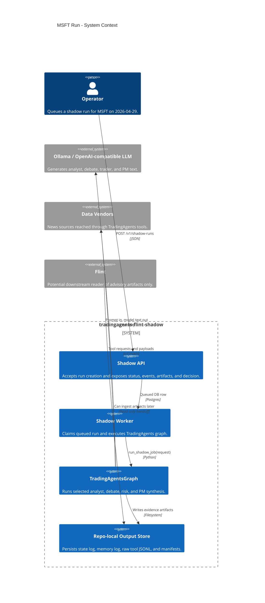
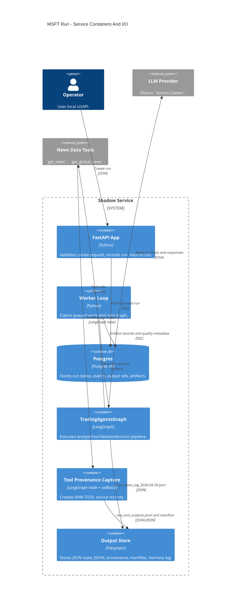
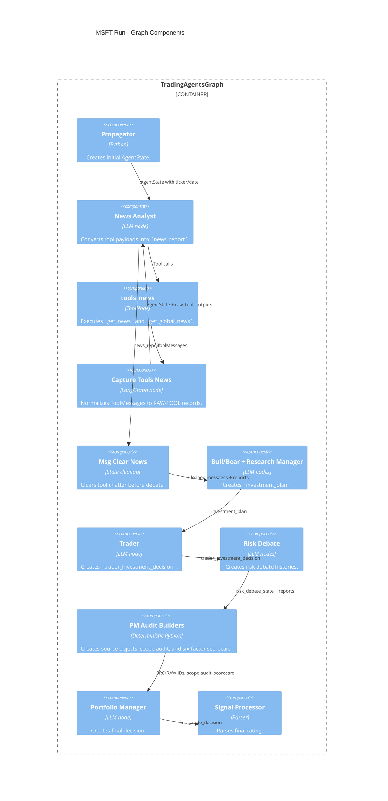
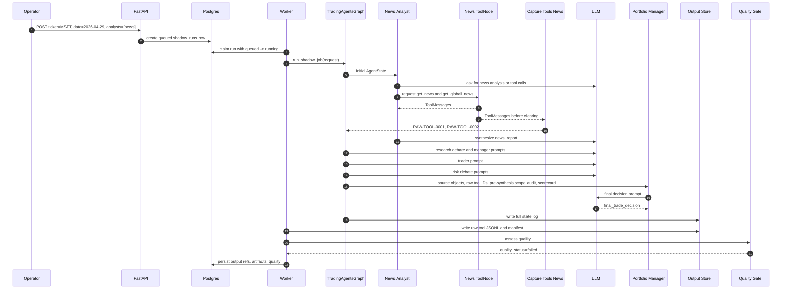

# Detailed Run I/O Report - MSFT 2026-04-29

Report date: 2026-05-01  
Repository: `tradingagents-flint-shadow`  
Run analyzed: MSFT shadow run, trade date `2026-04-29`, selected analyst `news`  
Primary evidence:

- State log: `output/logs/MSFT/TradingAgentsStrategy_logs/full_states_log_2026-04-29.json`
- Raw tool provenance: `output/provenance/MSFT/2026-04-29/raw_tool_outputs.jsonl`
- Raw tool manifest: `output/provenance/MSFT/2026-04-29/raw_tool_outputs_manifest.json`

This report uses the C4 pipeline view from `docs/flint/TRADINGAGENTS_C4_PIPELINE.md` and expands it into every material input/output observed in one completed run. It also applies the current upgraded rigor layer: raw source objects, required source citations, pre-synthesis scope audit, six-factor scorecard, and quality failure on citation or ticker/entity defects.

## Executive Summary

The MSFT run completed at workflow level and produced a final `Buy` rating. The upgraded deterministic quality gate marks the run `failed` because the final recommendation did not cite any available `SRC-*` or `RAW-TOOL-*` source IDs and because the pre-synthesis scope audit found unrelated Marvell evidence inside the news report.

The run is therefore useful as an evidence example, not as an acceptable Flint advisory recommendation. It demonstrates the intended workflow behavior: the service can complete a run, capture raw tool provenance, persist artifacts, and then reject the final decision when provenance and scope requirements are not met.

## Run Identity And Top-Level I/O

| Field | Value |
| --- | --- |
| Ticker | `MSFT` |
| Trade date | `2026-04-29` |
| Analyst set | `news` |
| Final parsed rating | `Buy` |
| Current recomputed quality status | `failed` |
| State log bytes | `56939` |
| State log SHA-256 | `6cf4baf984a848d877c83954e675750a126be4943a5d4ab36fe9b55aabee1c4f` |
| Raw provenance bytes | `3271` |
| Raw provenance SHA-256 | `9a0659c908e095c436623094e8a77fba0c47b1a87ba7595d7b4ab4b38` |

Top-level input:

```json
{
  "ticker": "MSFT",
  "trade_date": "2026-04-29",
  "selected_analysts": ["news"]
}
```

Top-level outputs:

| Output | Producer | Consumer |
| --- | --- | --- |
| `news_report` | News Analyst | Research debate, Trader, Risk debate, Portfolio Manager |
| `raw_tool_outputs` | Tool capture node | Portfolio Manager prompt, artifact store, quality audit |
| `source_objects` | Portfolio Manager audit builder | Portfolio Manager prompt, quality audit |
| `recommendation_scorecard` | Portfolio Manager audit builder | Portfolio Manager prompt, quality audit |
| `pre_synthesis_scope_audit` | Portfolio Manager audit builder | Portfolio Manager prompt, quality audit |
| `investment_plan` | Research Manager | Trader, Portfolio Manager |
| `trader_investment_decision` | Trader | Risk debate, state log |
| `risk_debate_state` | Risk analysts | Portfolio Manager, state log |
| `final_trade_decision` | Portfolio Manager | Signal parser, quality audit, memory log, API decision endpoint |

## C4 Context - Information Boundary



## C4 Container - Service I/O



## C4 Component - Graph I/O



## Runtime Sequence



## Step-by-Step I/O Ledger

| Step | Component | Input | Output | Evidence |
| --- | --- | --- | --- | --- |
| 1 | API create endpoint | `ticker=MSFT`, `trade_date=2026-04-29`, `selected_analysts=[news]` | Queued run row | Service API contract |
| 2 | Worker loop | Queued run | Running event and `run_shadow_job` request | DB event stream |
| 3 | Propagator | Request fields and memory lookup | Initial `AgentState` with empty reports and raw provenance arrays | `tradingagents/graph/propagation.py` |
| 4 | News Analyst | `company_of_interest=MSFT`, `trade_date=2026-04-29`, messages | Tool calls for news retrieval | LangGraph state |
| 5 | `tools_news` | Tool calls | `ToolMessage` results | Raw provenance JSONL |
| 6 | Capture Tools News | ToolMessages | `RAW-TOOL-0001`, `RAW-TOOL-0002` | `raw_tool_outputs.jsonl` |
| 7 | News Analyst | Tool results | `news_report` length 923 bytes/chars in state summary | State log |
| 8 | Message Clear | Report plus message state | Clean state for debate | Graph control flow |
| 9 | Research debate and manager | Reports | `investment_plan` length 2730 | State log |
| 10 | Trader | Investment plan and reports | `trader_investment_decision` length 2488 | State log |
| 11 | Risk debate | Trader plan and reports | `risk_debate_state` histories | State log |
| 12 | PM audit builders | Reports, raw tool outputs, risk state | `source_objects`, `pre_synthesis_scope_audit`, `recommendation_scorecard` | Recomputed current audit |
| 13 | Portfolio Manager | Plans, debate, sources, scope audit, scorecard | `final_trade_decision` length 3071 | State log |
| 14 | Signal Processor | Final decision text | Parsed rating `Buy` | Quality audit |
| 15 | Artifact writer | State, memory, raw provenance | State log, JSONL, manifest, memory log | Output paths |
| 16 | Quality gate | Final decision and final state | `quality_status=failed` | Recomputed quality |

## Raw Tool I/O

| Source ID | Tool | Analyst | Status | Output bytes | Output SHA-256 | Output summary |
| --- | --- | --- | --- | ---:| --- | --- |
| `RAW-TOOL-0001` | `get_news` | `news` | `success` | 341 | `b5eae00e389359b9e9ba7a1ab054cbae5727fd1fa4f9be4126ec3b637e27571c` | MSFT-specific news window from `2026-04-22` to `2026-04-29`; payload included a Qualcomm earnings headline, which is weak evidence for MSFT and illustrates why source-level scrutiny matters. |
| `RAW-TOOL-0002` | `get_global_news` | `news` | `success` | 977 | `b57dda47ed047f001641ee9e2bda1e4723a8afebfabe9190a1f46a5893015ada` | Global market news window from `2026-04-22` to `2026-04-29`; payload included Nasdaq and broader market headlines. |

Raw tool manifest:

```json
{
  "kind": "raw_tool_outputs_manifest",
  "record_count": 2,
  "source_ids": ["RAW-TOOL-0001", "RAW-TOOL-0002"],
  "tools": ["get_global_news", "get_news"],
  "jsonl_sha256": "9a0659c908e095c436623094e8a77fba0c47b1a87ba7595d7b4ab4b38"
}
```

## Agent State I/O

| State field | Producer | Consumer | Observed size / status |
| --- | --- | --- | --- |
| `company_of_interest` | Propagator | All nodes | `MSFT` |
| `trade_date` | Propagator | All nodes | `2026-04-29` |
| `market_report` | Market Analyst | Downstream agents | Empty; market analyst was not selected |
| `sentiment_report` | Social Analyst | Downstream agents | Empty; social analyst was not selected |
| `news_report` | News Analyst | Research, trader, risk, PM | 923 |
| `fundamentals_report` | Fundamentals Analyst | Downstream agents | Empty; fundamentals analyst was not selected |
| `investment_debate_state` | Bull/Bear researchers | Research Manager | Keys: `bear_history`, `bull_history`, `current_response`, `history`, `judge_decision` |
| `investment_plan` | Research Manager | Trader, PM | 2730 |
| `trader_investment_decision` | Trader | Risk debate, state log | 2488 |
| `risk_debate_state` | Risk analysts | PM, state log | Keys: `aggressive_history`, `conservative_history`, `history`, `judge_decision`, `neutral_history` |
| `source_objects` | PM audit builder | PM and quality | 3 |
| `raw_tool_outputs` | Capture Tools News | PM, artifact writer, quality | 2 |
| `recommendation_scorecard` | PM audit builder | PM and quality | Six-factor recomputation available |
| `final_trade_decision` | PM | Signal parser, quality, memory | 3071 |

## Source Object Contract

The final decision had three available source IDs:

| Source ID | Type | Meaning |
| --- | --- | --- |
| `SRC-NEWS-1` | report-level source | News analyst report |
| `RAW-TOOL-0001` | raw tool output | `get_news` result |
| `RAW-TOOL-0002` | raw tool output | `get_global_news` result |

The final decision cited none of them. This is a hard quality failure under the current rigor rules.

## Six-Factor Scorecard

This scorecard is recomputed from the persisted MSFT state using the current upgraded methodology.

| Factor | Available | Source ID | Score | Positive terms | Negative terms |
| --- | --- | --- | ---:| --- | --- |
| `technical_trend` | no | none | 0 | none | none |
| `momentum` | no | none | 0 | none | none |
| `volatility` | no | none | 0 | none | none |
| `news_sentiment` | yes | `SRC-NEWS-1` | 1 | `positive` | none |
| `fundamentals` | no | none | 0 | none | none |
| `risk_posture` | yes | `SRC-RISK-1` | -2 | `balanced`, `diversified` | `risk`, `uncertain`, `volatility`, `conservative` |

Scorecard total: `-1`  
Scorecard suggested rating: `Hold`  
Scorecard suggested direction: `bearish`  
Portfolio Manager final rating: `Buy`  
Reconciliation status: divergent and not explicitly reconciled in the final decision.

## Pre-Synthesis Scope Audit

The upgraded pre-synthesis audit inspects available analyst reports before Portfolio Manager synthesis.

| Audit field | Value |
| --- | --- |
| Requested ticker | `MSFT` |
| Inspected reports | `news_report` |
| Status | `failed` |
| Error | `pre_synthesis_unrelated_entity` |
| Evidence | `marvell (MRVL)` |

Interpretation: the news report contained unrelated issuer evidence. The PM should not treat that evidence as relevant to MSFT. The current quality layer marks this as a hard failure via `pre_synthesis_scope_contamination`.

## Quality Result

Current recomputed quality status: `failed`

| Finding | Severity | Meaning |
| --- | --- | --- |
| `missing_source_object_citation` | error | Final decision did not cite `SRC-NEWS-1`, `RAW-TOOL-0001`, or `RAW-TOOL-0002`. |
| `missing_raw_tool_citation` | error | Raw tool outputs existed but no `RAW-TOOL-*` ID was cited. |
| `no_explicit_source_reference` | warning | Final decision had no explicit source IDs, URLs, or recognized source language. |
| `pre_synthesis_scope_contamination` | error | Pre-PM source audit found unrelated Marvell evidence in the news report. |

## Interpretation

The run completed mechanically, but it should not be consumed by Flint as a valid advisory signal. The evidence chain shows:

- The selected analyst set was narrow: news only.
- The available raw source set was small: two tool outputs.
- The PM produced a `Buy` rating without citing the source IDs it was given.
- The deterministic six-factor scorecard suggested `Hold`, not `Buy`.
- The source audit found unrelated issuer contamination before final synthesis.

The upgraded quality system correctly rejects the result. This is the desired behavior: a run can produce a final recommendation and still be marked unusable when evidence discipline fails.

## Implementation Gap Closure

The following rigor gaps are now closed in code:

| Gap | Current implementation |
| --- | --- |
| Structured tool outputs | `RAW-TOOL-*` objects captured from graph `ToolMessage` outputs before message clearing. |
| Required citations | PM prompt requires `SRC-*` and `RAW-TOOL-*`; quality fails missing/invalid citations. |
| Pre-synthesis ticker/entity validation | PM audit builder creates `pre_synthesis_scope_audit`; quality fails contamination. |
| Six-factor scorecard | Scorecard factors are `technical_trend`, `momentum`, `volatility`, `news_sentiment`, `fundamentals`, `risk_posture`. |
| PM reconciliation | PM prompt requires scorecard reconciliation; quality warns on divergence without reconciliation language. |
| Failed quality on citation or ticker consistency | Citation and ticker/entity issues are severity `error`, producing `quality_status=failed`. |

## Reproduction Commands

Run the relevant test suite:

```bash
.venv/bin/python -m pytest \
  tests/test_tool_provenance.py \
  tests/test_quality_assessment.py \
  tests/test_service_contract.py \
  tests/test_worker_loop.py \
  tests/test_signal_processing.py \
  tests/test_structured_agents.py \
  -q
```

Current verification result: `51 passed`.

Inspect the run artifacts:

```bash
python3 -m json.tool output/logs/MSFT/TradingAgentsStrategy_logs/full_states_log_2026-04-29.json
python3 -m json.tool output/provenance/MSFT/2026-04-29/raw_tool_outputs_manifest.json
sed -n '1,5p' output/provenance/MSFT/2026-04-29/raw_tool_outputs.jsonl
```

## C4InterFlow Note

The C4InterFlow Architecture-as-Code model remains at:

- `Architecture/TradingAgentsFlintShadow.yaml`

Prepared render command:

```bash
C4InterFlow.Cli draw-diagrams \
  --aac-input-paths "./Architecture" \
  --aac-reader-strategy "C4InterFlow.Automation.Readers.YamlAaCReaderStrategy,C4InterFlow.Automation" \
  --interfaces "TradingAgentsFlintShadow.SoftwareSystems.*.Containers.*.Components.*.Interfaces.*" \
  --interfaces "TradingAgentsFlintShadow.SoftwareSystems.*.Containers.*.Interfaces.*" \
  --types c4 c4-static c4-sequence sequence \
  --levels-of-details context container component \
  --formats svg png md \
  --output-dir "./diagrams/tradingagents-flint-shadow"
```

This report embeds Mermaid C4-compatible views for immediate review. The C4InterFlow command is still prepared rather than executed because `C4InterFlow.Cli` is not installed on PATH in this environment.
