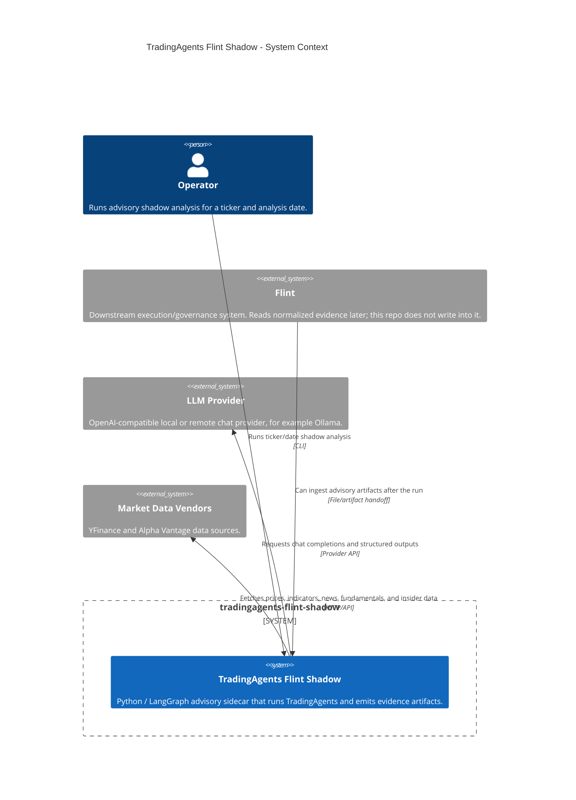
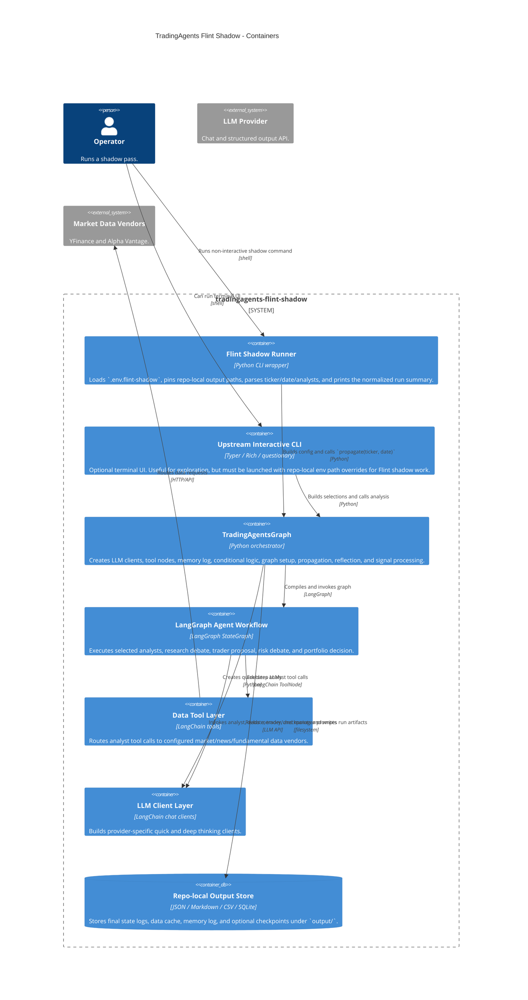
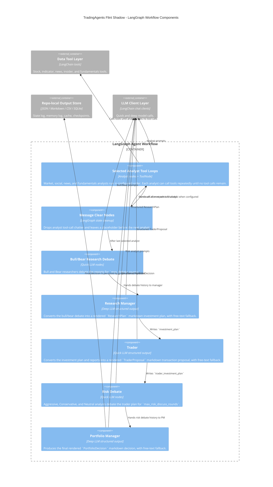
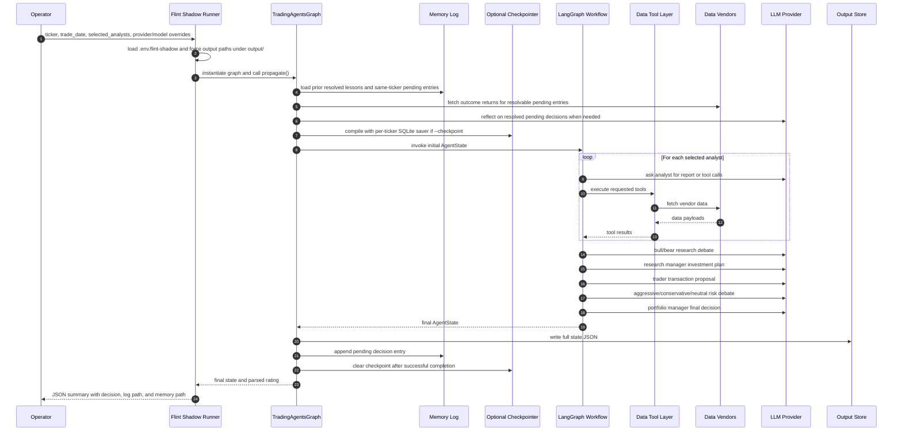
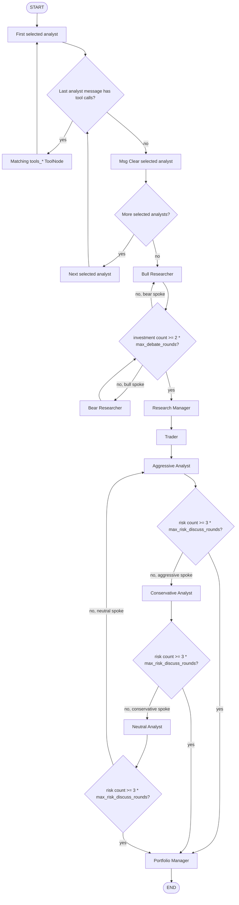
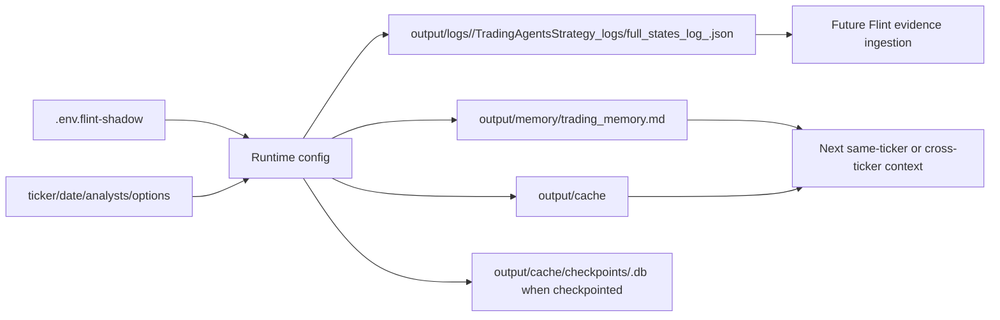

# TradingAgents C4 Pipeline Schema

This document maps the end-to-end TradingAgents pipeline as it is wired in this
Flint shadow-analysis repo. The repo is an advisory sidecar: it writes evidence
artifacts under `output/` and does not write into Flint or place broker orders.

## Scope

- Primary entrypoint: `scripts/flint/run_shadow_analysis.py`
- Orchestrator: `tradingagents/graph/trading_graph.py`
- Graph assembly: `tradingagents/graph/setup.py`
- Runtime state: `tradingagents/agents/utils/agent_states.py`
- Local artifacts: `output/logs`, `output/cache`, `output/memory`

## C4 Level 1: System Context



## C4 Level 2: Containers



## C4 Level 3: Workflow Components



## End-to-End Runtime Flow



## Pipeline State Contract

The graph passes one `AgentState` through every node. The important fields are:

| Field | Producer | Consumer |
| --- | --- | --- |
| `company_of_interest`, `trade_date` | Propagator | All agents and tool prompts |
| `past_context` | Memory log lookup | Portfolio Manager prompt context |
| `market_report` | Market Analyst | Bull/Bear, Trader, Risk analysts |
| `sentiment_report` | Social Analyst | Bull/Bear, Trader, Risk analysts |
| `news_report` | News Analyst | Bull/Bear, Trader, Risk analysts |
| `fundamentals_report` | Fundamentals Analyst | Bull/Bear, Trader, Risk analysts |
| `investment_debate_state` | Bull/Bear, Research Manager | Research debate routing and Research Manager |
| `investment_plan` | Research Manager | Trader and Portfolio Manager |
| `trader_investment_plan` | Trader | Risk analysts and Portfolio Manager |
| `risk_debate_state` | Risk analysts, Portfolio Manager | Risk debate routing and Portfolio Manager |
| `final_trade_decision` | Portfolio Manager | State logger, memory log, signal parser |

## Agent And Tool Mapping

| Stage | Graph nodes | LLM tier | Tool surface | Output |
| --- | --- | --- | --- | --- |
| Market analysis | `Market Analyst`, `tools_market`, `Msg Clear Market` | quick | `get_stock_data`, `get_indicators` | `market_report` |
| Social analysis | `Social Analyst`, `tools_social`, `Msg Clear Social` | quick | `get_news` | `sentiment_report` |
| News analysis | `News Analyst`, `tools_news`, `Msg Clear News` | quick | `get_news`, `get_global_news`, `get_insider_transactions` | `news_report` |
| Fundamentals analysis | `Fundamentals Analyst`, `tools_fundamentals`, `Msg Clear Fundamentals` | quick | `get_fundamentals`, `get_balance_sheet`, `get_cashflow`, `get_income_statement` | `fundamentals_report` |
| Investment debate | `Bull Researcher`, `Bear Researcher` | quick | none | `investment_debate_state` |
| Investment synthesis | `Research Manager` | deep | none | `investment_plan` |
| Trade translation | `Trader` | quick | none | `trader_investment_plan` |
| Risk debate | `Aggressive Analyst`, `Conservative Analyst`, `Neutral Analyst` | quick | none | `risk_debate_state` |
| Final decision | `Portfolio Manager` | deep | none | `final_trade_decision` |
| Rating parse | `SignalProcessor` | deterministic parser | none | `Buy`, `Overweight`, `Hold`, `Underweight`, or `Sell` |

## Control Logic



## Artifact Flow



## Flint Shadow Boundary

- The wrapper pins `results_dir` to `output/logs`.
- The wrapper pins `data_cache_dir` to `output/cache`.
- The wrapper pins `memory_log_path` to `output/memory/trading_memory.md`.
- The wrapper only prints a JSON summary and writes local artifacts.
- The graph has no broker-order container in this repo-specific model.
- Flint ingestion is a downstream consumer, not a write target from this repo.

## C4InterFlow Model

A YAML Architecture-as-Code model for this schema is stored at:

- `Architecture/TradingAgentsFlintShadow.yaml`

The prepared render command is:

```bash
C4InterFlow.Cli draw-diagrams \
  --aac-input-paths "./Architecture" \
  --aac-reader-strategy "C4InterFlow.Automation.Readers.YamlAaCReaderStrategy,C4InterFlow.Automation" \
  --interfaces "TradingAgentsFlintShadow.SoftwareSystems.*.Containers.*.Components.*.Interfaces.*" \
  --interfaces "TradingAgentsFlintShadow.SoftwareSystems.*.Containers.*.Interfaces.*" \
  --types c4 c4-static c4-sequence sequence \
  --levels-of-details context container component \
  --formats svg png md \
  --output-dir "./diagrams/tradingagents-flint-shadow"
```

This command was prepared but not executed here because `C4InterFlow.Cli` is not
currently installed on PATH.

## Source Map

- `scripts/flint/run_shadow_analysis.py`: wrapper entrypoint, env loading, repo-local path overrides, graph invocation, JSON summary.
- `tradingagents/graph/trading_graph.py`: graph orchestration, LLM client setup, tool node setup, memory resolution, checkpointing, state logging, memory logging, rating parsing.
- `tradingagents/graph/setup.py`: LangGraph nodes and edges.
- `tradingagents/graph/conditional_logic.py`: analyst tool-loop routing, bull/bear debate loop, risk debate loop.
- `tradingagents/graph/propagation.py`: initial `AgentState` construction and graph invocation config.
- `tradingagents/agents/utils/agent_states.py`: canonical state fields.
- `tradingagents/agents/schemas.py`: structured `ResearchPlan`, `TraderProposal`, and `PortfolioDecision` schemas.
- `tradingagents/agents/utils/structured.py`: structured-output wrapper with free-text fallback.
- `tradingagents/dataflows/interface.py`: vendor routing and fallback.
- `tradingagents/agents/utils/memory.py`: append-only decision log and prior-context injection.
